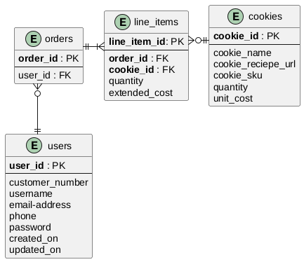

#+OPTIONS: H:3 num:t toc:t \n:nil @:t ::t |:t ^:{} _:{} -:t f:t *:t <:t todo:t
#+INFOJS_OPT: view:t toc:t ltoc:t mouse:underline buttons:0 path:org-info.js
#+HTML_HEAD: <link rel="stylesheet" type="text/css" href="solarized-dark.css" />
#+HTML_LINK_HOME: https://pimiento.github.io/
#+HTML_LINK_UP: https://pimiento.github.io/
#+KEYWORDS: sqlalchemy alembic orm
#+TITLE: Essential SQLAlchemy (v1/v2)
:PROPERTIES:
:header-args:python: :exports both
:END:
* Chapter 1: Schema and Types

** SQLAlchemy v1
#+BEGIN_SRC python :results output
  import sqlalchemy
  print(sqlalchemy.__version__)
#+END_SRC

#+RESULTS:
: 2.0.52

#+NAME: A1
#+BEGIN_SRC python :session ch1 :results none
  from sqlalchemy import MetaData

  metadata = MetaData()
#+END_SRC

#+NAME: B1
#+BEGIN_SRC python :session ch1 :results none
  from sqlalchemy import Table, Column, Integer, Numeric, String, CheckConstraint

  cookies = Table(
      "cookies",
      metadata,
      Column("cookie_id", Integer(), primary_key=True),
      Column("cookie_name", String(50), index=True),
      Column("cookie_recipie_url", String(255)),
      Column("cookie_sku", String(55)),
      Column("quantity", Integer()),
      Column("unit_cost", Numeric(12, 2)),
      CheckConstraint("unit_cost >= 0.00", name="unit_cost_positive"),
  )
#+END_SRC

#+NAME: C1
#+BEGIN_SRC python :session ch1 :results none
  from datetime import datetime
  from sqlalchemy import DateTime, PrimaryKeyConstraint, UniqueConstraint

  users = Table(
      "users",
      metadata,
      Column("user_id", Integer()),
      Column("username", String(15), nullable=False),
      Column("email_address", String(255), nullable=False),
      Column("phone", String(20), nullable=False),
      Column("password", String(25), nullable=False),
      Column("created_on", DateTime(), default=datetime.now),
      Column("updated_on", DateTime(), default=datetime.now, onupdate=datetime.now),
      PrimaryKeyConstraint("user_id", name="user_pk"),
      UniqueConstraint("username", name="uix_username"),
  )
#+END_SRC

#+BEGIN_SRC plantuml :file er.png
  @startuml
  skinparam linetype ortho
  skinparam nodesep 30
  skinparam ranksep 40

  skinparam entity {
  	BackgroundColor White
  	BorderColor Black
  	BorderThickness 1.2
  	FontStyle bold
  	FontSize 12
  }

  entity orders {
  	,**order_id** : PK
  	--
  	user_id : FK
  }
  entity line_items {
  	,**line_item_id**: PK
  	--
  	,**order_id** : FK
  	,**cookie_id** : FK
  	quantity
  	extended_cost
  }
  entity cookies {
  	,**cookie_id** : PK
  	--
  	cookie_name
  	cookie_reciepe_url
  	cookie_sku
  	quantity
  	unit_cost
  }
  entity users {
  	,**user_id** : PK
  	--
  	customer_number
  	username
  	email-address
  	phone
  	password
  	created_on
  	updated_on
  }

  orders ||--|{ line_items
  line_items }o--|| cookies
  orders }o--|| users

  orders -[hidden]right- line_items
  line_items -[hidden]right- cookies
  orders -[hidden]down- users
  @enduml
#+END_SRC

#+RESULTS:

#+NAME: D1
#+BEGIN_SRC python :session ch1 :results none
  from sqlalchemy import ForeignKey, Boolean

  orders = Table(
      "orders",
      metadata,
      Column("order_id", Integer(), primary_key=True),
      Column("user_id", ForeignKey("users.user_id")),
      Column("shipped", Boolean(), default=False),
  )

  line_items = Table(
      "line_items",
      metadata,
      Column("line_items_id", Integer(), primary_key=True),
      Column("order_id", ForeignKey("orders.order_id")),
      Column("cookie_id", ForeignKey("cookies.cookie_id")),
      Column("quantity", Integer()),
      Column("extended_cost", Numeric(12, 2)),
  )
#+END_SRC

#+NAME: E1
#+BEGIN_SRC python :session ch1 :results none :tangle ch1-v1.py :noweb tangle :shebang "#!/usr/bin/env python3"
  <<A1>>
  <<B1>>
  <<C1>>
  <<D1>>
  from sqlalchemy import create_engine

  engine = create_engine("sqlite:///:memory:", echo=True)
  metadata.create_all(engine)
#+END_SRC

** SQLAlchemy v2
#+BEGIN_SRC python :results none :tangle ch1-v2.py :noweb tangle :shebang "#!/usr/bin/env python3"
  #!/usr/bin/env python3
  from datetime import datetime
  from decimal import Decimal

  from sqlalchemy import (
      Boolean,
      CheckConstraint,
      DateTime,
      ForeignKey,
      Integer,
      Numeric,
      String,
      UniqueConstraint,
      create_engine,
  )
  from sqlalchemy.orm import DeclarativeBase, Mapped, mapped_column, relationship

  class Base(DeclarativeBase):
      """Базовый класс для всех ORM-моделей."""

  class Cookie(Base):
      __tablename__ = "cookies"

      cookie_id: Mapped[int] = mapped_column(Integer, primary_key=True)
      cookie_name: Mapped[str | None] = mapped_column(String(50), index=True)
      cookie_recipie_url: Mapped[str | None] = mapped_column(String(255))
      cookie_sku: Mapped[str | None] = mapped_column(String(55))
      quantity: Mapped[int | None] = mapped_column(Integer)
      unit_cost: Mapped[Decimal | None] = mapped_column(Numeric(12, 2))

      __table_args__ = (CheckConstraint("unit_cost >= 0.00", name="unit_cost_positive"),)

      # Связь: одна cookie -> много line_items
      line_items: Mapped[list["LineItem"]] = relationship(back_populates="cookie")

      def __repr__(self) -> str:
          return f"Cookie(cookie_id={self.cookie_id!r}, cookie_name={self.cookie_name!r})"

  class User(Base):
      __tablename__ = "users"

      user_id: Mapped[int] = mapped_column(Integer, primary_key=True)
      username: Mapped[str] = mapped_column(String(15), nullable=False)
      email_address: Mapped[str] = mapped_column(String(255), nullable=False)
      phone: Mapped[str] = mapped_column(String(20), nullable=False)
      password: Mapped[str] = mapped_column(String(25), nullable=False)
      created_on: Mapped[datetime | None] = mapped_column(DateTime, default=datetime.now)
      updated_on: Mapped[datetime | None] = mapped_column(
          DateTime, default=datetime.now, onupdate=datetime.now
      )

      __table_args__ = (UniqueConstraint("username", name="uix_username"),)

      # Связь: один user -> много orders
      orders: Mapped[list["Order"]] = relationship(back_populates="user")

      def __repr__(self) -> str:
          return f"User(user_id={self.user_id!r}, username={self.username!r})"

  class Order(Base):
      __tablename__ = "orders"

      order_id: Mapped[int] = mapped_column(Integer, primary_key=True)
      user_id: Mapped[int | None] = mapped_column(ForeignKey("users.user_id"))
      shipped: Mapped[bool | None] = mapped_column(Boolean, default=False)

      # Связи
      user: Mapped["User | None"] = relationship(back_populates="orders")
      line_items: Mapped[list["LineItem"]] = relationship(back_populates="order")

      def __repr__(self) -> str:
          return f"Order(order_id={self.order_id!r}, user_id={self.user_id!r})"

  class LineItem(Base):
      __tablename__ = "line_items"

      line_items_id: Mapped[int] = mapped_column(Integer, primary_key=True)
      order_id: Mapped[int | None] = mapped_column(ForeignKey("orders.order_id"))
      cookie_id: Mapped[int | None] = mapped_column(ForeignKey("cookies.cookie_id"))
      quantity: Mapped[int | None] = mapped_column(Integer)
      extended_cost: Mapped[Decimal | None] = mapped_column(Numeric(12, 2))

      # Связи
      order: Mapped["Order | None"] = relationship(back_populates="line_items")
      cookie: Mapped["Cookie | None"] = relationship(back_populates="line_items")

      def __repr__(self) -> str:
          return (
              f"LineItem(line_items_id={self.line_items_id!r}, "
              f"order_id={self.order_id!r}, cookie_id={self.cookie_id!r})"
          )

  if __name__ == "__main__":
      engine = create_engine("sqlite:///:memory:", echo=True)
      Base.metadata.create_all(engine)
#+END_SRC

* Chapter 2: Working with Data via SQLAlchemy Core
** SQLAlchemy v1
:PROPERTIES:
  :header-args: :cache yes
  :header-args:python: :tangle ch2-v1.py
  :header-args: :session *ch2*
:END:
#+BEGIN_SRC python :results none :shebang "#!/usr/bin/env python3"
  from datetime import datetime

  from sqlalchemy import (
      Boolean,
      CheckConstraint,
      Column,
      DateTime,
      ForeignKey,
      Integer,
      MetaData,
      Numeric,
      PrimaryKeyConstraint,
      String,
      Table,
      UniqueConstraint,
      create_engine,
  )
  from sqlparse import format as sqlformat

  def sqlf(
      sql: str | object,
      reindent=True,
      keyword_case="upper",
      indent_width=2,
      strip_comments=False,
      identifier_case="lower",
  ):
      if not isinstance(sql, str):
          sql = str(sql)
      return sqlformat(
          sql,
          encoding="utf8",
          reindent=reindent,
          keyword_case=keyword_case,
          indent_width=indent_width,
          strip_comments=strip_comments,
          identifier_case=identifier_case,
      )

  metadata = MetaData()

  cookies = Table(
      "cookies",
      metadata,
      Column("cookie_id", Integer(), primary_key=True),
      Column("cookie_name", String(50), index=True),
      Column("cookie_recipe_url", String(255), unique=True),
      Column("cookie_sku", String(55), unique=True),
      Column("quantity", Integer()),
      Column("unit_cost", Numeric(12, 2)),
      CheckConstraint("unit_cost >= 0.00", name="unit_cost_positive"),
  )

  users = Table(
      "users",
      metadata,
      Column("user_id", Integer()),
      Column("username", String(15), nullable=False),
      Column("email_address", String(255), nullable=False),
      Column("phone", String(20), nullable=False),
      Column("password", String(25), nullable=False),
      Column("created_on", DateTime(), default=datetime.now),
      Column("updated_on", DateTime(), default=datetime.now, onupdate=datetime.now),
      PrimaryKeyConstraint("user_id", name="user_pk"),
      UniqueConstraint("username", name="uix_username"),
  )

  orders = Table(
      "orders",
      metadata,
      Column("order_id", Integer(), primary_key=True),
      Column("user_id", ForeignKey("users.user_id")),
      Column("shipped", Boolean(), default=False),
  )

  line_items = Table(
      "line_items",
      metadata,
      Column("line_items_id", Integer(), primary_key=True),
      Column("order_id", ForeignKey("orders.order_id")),
      Column("cookie_id", ForeignKey("cookies.cookie_id")),
      Column("quantity", Integer()),
      Column("extended_cost", Numeric(12, 2)),
  )

  engine = create_engine("sqlite:///:memory:", echo=True)
  connection = engine.connect()
  metadata.create_all(engine)
#+END_SRC

*** Insert Data
#+BEGIN_SRC python :results value
  ins = cookies.insert().values(
      cookie_name="chocolate chip",
      cookie_recipe_url="http://some.aweso.me/cookie/recipe.html",
      cookie_sku="CC01",
      quantity="12",
      unit_cost="0.50"
  )
  sqlf(ins)
#+END_SRC

#+RESULTS: A2
: INSERT INTO cookies (cookie_name, cookie_recipe_url, cookie_sku, quantity, unit_cost)
: VALUES (:cookie_name, :cookie_recipe_url, :cookie_sku, :quantity, :unit_cost)

#+BEGIN_SRC python :results value
  import json

  json.dumps(ins.compile().params, indent=2)
#+END_SRC

#+RESULTS[6c84e4959502481d55c0eede700458833e44cb09]: B2
: {
:   "cookie_name": "chocolate chip",
:   "cookie_recipe_url": "http://some.aweso.me/cookie/recipe.html",
:   "cookie_sku": "CC01",
:   "quantity": "12",
:   "unit_cost": "0.50"
: }

#+BEGIN_SRC python :results table
  result = connection.execute(ins)
  result.inserted_primary_key
#+END_SRC

#+RESULTS[2f53d5414462ab280cdac9899df147cdfb23ca85]: C2
| 1 |

#+BEGIN_SRC python :results table
  ins = cookies.insert()
  result = connection.execute(
      ins,
      dict(
          cookie_name="dark chocolate chip",
          cookie_recipe_url="http://some.aweso.me/cookie/recipe_dark.html",
          cookie_sku="CC02",
          quantity=1,
          unit_cost=0.75,
      ),
  )
  result.inserted_primary_key
#+END_SRC

#+RESULTS[ce29752b9e0ffb2e8359d9455b40c0177eaed45b]: D2
| 2 |

#+BEGIN_SRC python :results table
  from sqlalchemy import insert
  ins = insert(cookies).values(
      cookie_name="ligth chocolate chip",
      cookie_recipe_url="http://some.aweso.me/cookie/recipe_light.html",
      cookie_sku="CC03",
      quantity=10,
      unit_cost=0.5
  )
  result = connection.execute(ins)
  result.inserted_primary_key
#+END_SRC

#+RESULTS[27f2d7147460a4ef494532268ad9635b7b554f06]: E2
| 3 |

#+BEGIN_SRC python :results table
  ins = cookies.insert()
  inventory_list = [
      {
          "cookie_name": "peanut butter",
          "cookie_recipe_url": "http://some.aweso.me/cookie/panut.html",
          "cookie_sku": "PB01",
          "quantity": 24,
          "unit_cost": 0.25
      },
      {
          "cookie_name": "oatmeal raisin",
          "cookie_recipe_url": "http://some.okay.me/cookie/raisin.html",
          "cookie_sku": "EWW01",
          "quantity": 100,
          "unit_cost": 1.00
      }
  ]

  result = connection.execute(ins, inventory_list)
  result.inserted_primary_key_rows
#+END_SRC

#+RESULTS[4a8500d49f6c26986acb280384da05aba54bef5c]:
| None |
| None |

*** Querying Data
#+BEGIN_SRC python :results table
  from sqlalchemy.sql import select

  s = select(cookies)
  # ResultProxy
  rp = connection.execute(s)
  rp.fetchall()
#+END_SRC

#+RESULTS[e34d92c2943fc699b5606f0b46be7beb21db1388]:
| 1 | chocolate chip       | http://some.aweso.me/cookie/recipe.html       | CC01  |  12 | Decimal | (0.50) |
| 2 | dark chocolate chip  | http://some.aweso.me/cookie/recipe_dark.html  | CC02  |   1 | Decimal | (0.75) |
| 3 | ligth chocolate chip | http://some.aweso.me/cookie/recipe_light.html | CC03  |  10 | Decimal | (0.50) |
| 4 | peanut butter        | http://some.aweso.me/cookie/panut.html        | PB01  |  24 | Decimal | (0.25) |
| 5 | oatmeal raisin       | http://some.okay.me/cookie/raisin.html        | EWW01 | 100 | Decimal | (1.00) |

#+BEGIN_SRC python :results table
  s = cookies.select()
  rp = connection.execute(s)
  results = rp.fetchall()
  results
#+END_SRC

#+RESULTS[2800f4ee31f49d7d6b362d7ee7093f65108d076a]:
| 1 | chocolate chip       | http://some.aweso.me/cookie/recipe.html       | CC01  |  12 | Decimal | (0.50) |
| 2 | dark chocolate chip  | http://some.aweso.me/cookie/recipe_dark.html  | CC02  |   1 | Decimal | (0.75) |
| 3 | ligth chocolate chip | http://some.aweso.me/cookie/recipe_light.html | CC03  |  10 | Decimal | (0.50) |
| 4 | peanut butter        | http://some.aweso.me/cookie/panut.html        | PB01  |  24 | Decimal | (0.25) |
| 5 | oatmeal raisin       | http://some.okay.me/cookie/raisin.html        | EWW01 | 100 | Decimal | (1.00) |

**** ResultProxy
#+BEGIN_SRC python :results table
  first_row = results[0]
  (
      first_row[1],
      first_row.cookie_name,
      # так не работает в SQLAlchemy 2
      #first_row[cookies.c.cookie_name],
      # так работает в SQLAlchemy 2
      first_row._mapping[cookies.c.cookie_name]
  )
#+END_SRC

#+RESULTS[0e4b28e683fb34c9cf927a4ee33749f0c86a4e79]:
| chocolate chip | chocolate chip | chocolate chip |

#+BEGIN_SRC python :results output
  rp = connection.execute(s)
  for record in rp:
      print(record.cookie_name)
#+END_SRC

#+RESULTS[111aa8e58f95f1c58373419ef284b39f24928b09]:
: 2026-09-16 18:20:06,397 INFO sqlalchemy.engine.Engine SELECT cookies.cookie_id, cookies.cookie_name, cookies.cookie_recipe_url, cookies.cookie_sku, cookies.quantity, cookies.unit_cost 
: FROM cookies
: 2026-09-16 18:20:06,398 INFO sqlalchemy.engine.Engine [cached since 0.1297s ago] ()
: chocolate chip
: dark chocolate chip
: ligth chocolate chip
: peanut butter
: oatmeal raisin

**** Controlling the Columns in the Query
#+BEGIN_SRC python :results output
  s = select(cookies.c.cookie_name, cookies.c.quantity)
  rp = connection.execute(s)
  print(rp.keys())
  result = rp.first()
  print(result)
#+END_SRC

#+RESULTS[d36e227d4963ac6498d81bc68b7230f0482aee36]:
: 2026-09-16 18:20:06,420 INFO sqlalchemy.engine.Engine SELECT cookies.cookie_name, cookies.quantity 
: FROM cookies
: 2026-09-16 18:20:06,421 INFO sqlalchemy.engine.Engine [generated in 0.00045s] ()
: RMKeyView(['cookie_name', 'quantity'])
: ('chocolate chip', 12)

**** Ordering
#+BEGIN_SRC python :results output
  s = select(cookies.c.cookie_name, cookies.c.quantity)
  s = s.order_by(cookies.c.quantity)
  rp = connection.execute(s)
  for cookie in rp:
      print("{} - {}".format(cookie.quantity, cookie.cookie_name))
#+END_SRC

#+RESULTS[1a2648ac7db3983f3b128e81e12e34b1e0e3511b]:
: 2026-09-16 18:20:06,443 INFO sqlalchemy.engine.Engine SELECT cookies.cookie_name, cookies.quantity 
: FROM cookies ORDER BY cookies.quantity
: 2026-09-16 18:20:06,443 INFO sqlalchemy.engine.Engine [generated in 0.00017s] ()
: 1 - dark chocolate chip
: 10 - ligth chocolate chip
: 12 - chocolate chip
: 24 - peanut butter
: 100 - oatmeal raisin

#+BEGIN_SRC python :results table
  from sqlalchemy import desc
  s = select(cookies.c.cookie_name, cookies.c.quantity)
  s = s.order_by(desc(cookies.c.quantity))
  rp = connection.execute(s)
  rp.fetchall()
#+END_SRC

#+RESULTS[223725263b0eabd2280efdb561fdde8f1e40f11d]:
| oatmeal raisin       | 100 |
| peanut butter        |  24 |
| chocolate chip       |  12 |
| ligth chocolate chip |  10 |
| dark chocolate chip  |   1 |

**** Limiting
#+BEGIN_SRC python :results output
  s = select(cookies.c.cookie_name, cookies.c.quantity)
  s = s.order_by(cookies.c.quantity)
  s = s.limit(2)
  rp = connection.execute(s)
  print([result.cookie_name for result in rp])
#+END_SRC

#+RESULTS[61fc508f77cde00bb8a46a1cff9f7714585d6bac]:
: 2026-09-16 18:20:06,508 INFO sqlalchemy.engine.Engine SELECT cookies.cookie_name, cookies.quantity 
: FROM cookies ORDER BY cookies.quantity
:  LIMIT ? OFFSET ?
: 2026-09-16 18:20:06,512 INFO sqlalchemy.engine.Engine [generated in 0.00363s] (2, 0)
: ['dark chocolate chip', 'ligth chocolate chip']

**** Functions and Labels
#+BEGIN_SRC python :results output
  from sqlalchemy.sql import func

  s = select(func.sum(cookies.c.quantity))
  rp = connection.execute(s)
  print(rp.scalar())
#+END_SRC

#+RESULTS[dab408afcef7a07ab4529319e360e98963ef9253]:
: 2026-09-16 18:20:06,530 INFO sqlalchemy.engine.Engine SELECT sum(cookies.quantity) AS sum_1 
: FROM cookies
: 2026-09-16 18:20:06,531 INFO sqlalchemy.engine.Engine [generated in 0.00018s] ()
: 147

#+BEGIN_SRC python :results output
  s = select(func.count(cookies.c.cookie_name))
  rp = connection.execute(s)
  record = rp.first()
  print(record._fields)
  print(record.count_1)
#+END_SRC

#+RESULTS[cd4d9e1c7b306fcaac0f2ec879ba6eb9b8820a76]:
: 2026-09-16 18:20:06,548 INFO sqlalchemy.engine.Engine SELECT count(cookies.cookie_name) AS count_1 
: FROM cookies
: 2026-09-16 18:20:06,548 INFO sqlalchemy.engine.Engine [generated in 0.00028s] ()
: ('count_1',)
: 5

#+BEGIN_SRC python :results output
  s = select(func.count(cookies.c.cookie_name).label('inventory_count'))
  rp = connection.execute(s)
  record = rp.first()
  print(record._fields)
  print(record.inventory_count)
#+END_SRC

#+RESULTS[631333575ed407008ac3e744e2dd1071d2ad5fc8]:
: 2026-09-16 18:20:06,572 INFO sqlalchemy.engine.Engine SELECT count(cookies.cookie_name) AS inventory_count 
: FROM cookies
: 2026-09-16 18:20:06,572 INFO sqlalchemy.engine.Engine [generated in 0.00027s] ()
: ('inventory_count',)
: 5

**** Filtering
#+BEGIN_SRC python :results table
  s = select(cookies).where(cookies.c.cookie_name == "chocolate chip")
  rp = connection.execute(s)
  record = rp.first()
  [
      (k, repr(v) if hasattr(v, "quantize") else v)
      for k, v in dict(record._mapping.items()).items()
  ]
#+END_SRC

#+RESULTS[eeffa461b10a57c7ba2d693a96c1074d82ddd5dd]:
| cookie_id         | 1                                       |
| cookie_name       | chocolate chip                          |
| cookie_recipe_url | http://some.aweso.me/cookie/recipe.html |
| cookie_sku        | CC01                                    |
| quantity          | 12                                      |
| unit_cost         | Decimal('0.50')                         |

#+BEGIN_SRC python :results output
  s = select(cookies).where(cookies.c.cookie_name.like("%chocolate%"))
  rp = connection.execute(s)
  for record in rp:
      print(record.cookie_name)
#+END_SRC

#+RESULTS[1923587b001fd049bf657d33ffc97e3313882d08]:
: 2026-09-16 18:20:06,635 INFO sqlalchemy.engine.Engine SELECT cookies.cookie_id, cookies.cookie_name, cookies.cookie_recipe_url, cookies.cookie_sku, cookies.quantity, cookies.unit_cost 
: FROM cookies 
: WHERE cookies.cookie_name LIKE ?
: 2026-09-16 18:20:06,638 INFO sqlalchemy.engine.Engine [generated in 0.00392s] ('%chocolate%',)
: chocolate chip
: dark chocolate chip
: ligth chocolate chip

#+BEGIN_SRC python :results table
  s = select(cookies.c.cookie_name, "SKU-" + cookies.c.cookie_sku)
  [row for row in connection.execute(s)]
#+END_SRC

#+RESULTS[43fc9fc739efdcb3257ce1df944786476e960b19]:
| chocolate chip       | SKU-CC01  |
| dark chocolate chip  | SKU-CC02  |
| ligth chocolate chip | SKU-CC03  |
| peanut butter        | SKU-PB01  |
| oatmeal raisin       | SKU-EWW01 |

#+BEGIN_SRC python :results table
  from sqlalchemy import cast

  s = select(
      cookies.c.cookie_name,
      cast((cookies.c.quantity * cookies.c.unit_cost), Numeric(12, 2)).label("inv_cost"),
  )
  [(row.cookie_name, repr(row.inv_cost)) for row in connection.execute(s)]
#+END_SRC

#+RESULTS[e77d9a46c98a0d29f5d2e887b32d948c8aff4b24]:
| chocolate chip       | Decimal('6.00')   |
| dark chocolate chip  | Decimal('0.75')   |
| ligth chocolate chip | Decimal('5.00')   |
| peanut butter        | Decimal('6.00')   |
| oatmeal raisin       | Decimal('100.00') |

**** Conjunctions
#+BEGIN_SRC python :results table
  from sqlalchemy import and_, or_, not_

  s = select(cookies).where(and_(cookies.c.quantity > 23, cookies.c.unit_cost < 0.40))
  [row.cookie_name for row in connection.execute(s)]
#+END_SRC

#+RESULTS[26e274d9d4a427015efa928c324c4c0424561b44]:
| peanut butter |

#+BEGIN_SRC python :results table
  s = select(cookies).where(
      or_(cookies.c.quantity.between(10, 50), cookies.c.cookie_name.contains("chip"))
  )
  [(row.cookie_name,) for row in connection.execute(s)]
#+END_SRC

#+RESULTS[59dc52c5605d049ac5a987e4586dc5435b449116]:
| chocolate chip       |
| dark chocolate chip  |
| ligth chocolate chip |
| peanut butter        |

*** Updating Data
#+BEGIN_SRC python :results value
  from sqlalchemy import update

  u = update(cookies).where(cookies.c.cookie_name == "chocolate chip")
  u = u.values(quantity=(cookies.c.quantity + 120))
  result = connection.execute(u)
  result.rowcount
#+END_SRC

#+RESULTS[847d575b29c958aac6097fd1f5f38ab15233c881]:
: 1

#+BEGIN_SRC python :results table
  s = select(cookies).where(cookies.c.cookie_name == "chocolate chip")
  result = connection.execute(s).first()
  [
      (
          key,
          (
              repr(result._mapping[key])
              if hasattr(result._mapping[key], "quantize")
              else result._mapping[key]
          ),
      )
      for key in result._mapping.keys()
  ]
#+END_SRC

#+RESULTS[3b87446799c9d1eafeac3f98a9b95850e0392495]:
| cookie_id         | 1                                       |
| cookie_name       | chocolate chip                          |
| cookie_recipe_url | http://some.aweso.me/cookie/recipe.html |
| cookie_sku        | CC01                                    |
| quantity          | 132                                     |
| unit_cost         | Decimal('0.50')                         |

*** Deleting Data
#+BEGIN_SRC python :results value
  from sqlalchemy import delete

  u = delete(cookies).where(cookies.c.cookie_name == "dark chocolate chip")
  result = connection.execute(u)
  result.rowcount
#+END_SRC

#+RESULTS[0ca3bff6e5691d71853f6a179a07305f7927b9c5]:
: 1

#+BEGIN_SRC python :results value
  s = select(cookies).where(cookies.c.cookie_name == "dark chocolate chip")
  result = connection.execute(s).fetchall()
  len(result)
#+END_SRC

#+RESULTS[0186e481f8730015502615c0c5317b7021defdab]:
: 0

*** Joins
#+BEGIN_SRC python :results silent
  customer_list = [
      {
          "username": "cookiemon",
          "email_address": "mon@cookie.com",
          "phone": "111-111-1111",
          "password": "password",
      },
      {
          "username": "cakeeater",
          "email_address": "cakeeater@cake.com",
          "phone": "222-222-2222",
          "password": "password",
      },
      {
          "username": "pieguy",
          "email_address": "guy@pie.com",
          "phone": "333-333-3333",
          "password": "password",
      },
  ]
  ins = users.insert()
  result = connection.execute(ins, customer_list)
#+END_SRC

#+BEGIN_SRC python :results none
  ins = insert(orders).values(user_id=1, order_id=1)
  result = connection.execute(ins)
  ins = insert(line_items)
  order_items = [
      {"order_id": 1, "cookie_id": 1, "quantity": 2, "extended_cost": 1.00},
      {"order_id": 1, "cookie_id": 3, "quantity": 12, "extended_cost": 3.00},
  ]
  result = connection.execute(ins, order_items)
  ins = insert(orders).values(user_id=2, order_id=2)
  result = connection.execute(ins)
  ins = insert(line_items)
  order_items = [
      {"order_id": 2, "cookie_id": 1, "quantity": 24, "extended_cost": 12.00},
      {"order_id": 2, "cookie_id": 4, "quantity": 6, "extended_cost": 6.00},
  ]
  result = connection.execute(ins, order_items)
#+END_SRC

#+BEGIN_SRC python :results table
  s = select(line_items)
  rp = connection.execute(s)
  [tuple(f for f in rp.keys())] + [row for row in rp]
#+END_SRC

#+RESULTS[6c67ac82f1b3fa17449e94614678bdd9b9a86c01]:
| line_items_id | order_id | cookie_id | quantity | extended_cost |         |
|             1 |        1 |         1 |        2 | Decimal       | (1.00)  |
|             2 |        1 |         3 |       12 | Decimal       | (3.00)  |
|             3 |        2 |         1 |       24 | Decimal       | (12.00) |
|             4 |        2 |         4 |        6 | Decimal       | (6.00)  |

#+BEGIN_SRC python :results table
  s = select(orders)
  rp = connection.execute(s)
  [tuple(f for f in rp.keys())] + [row for row in rp]
#+END_SRC

#+RESULTS[d267590cf86f6d096b1bb878728114e7c6714fb0]:
| order_id | user_id | shipped |
|        1 |       1 | False   |
|        2 |       2 | False   |

#+BEGIN_SRC python :results table
  s = select(users)
  rp = connection.execute(s)
  [tuple(f for f in rp.keys())] + [row for row in rp]
#+END_SRC

#+RESULTS[5ecd8eac1228fddbc2304d381cc0148fc740d30d]:
| user_id | username  | email_address      |        phone | password | created_on        | updated_on                 |                   |                            |
|       1 | cookiemon | mon@cookie.com     | 111-111-1111 | password | datetime.datetime | (2026 9 16 18 20 6 947339) | datetime.datetime | (2026 9 16 18 20 6 947349) |
|       2 | cakeeater | cakeeater@cake.com | 222-222-2222 | password | datetime.datetime | (2026 9 16 18 20 6 947352) | datetime.datetime | (2026 9 16 18 20 6 947355) |
|       3 | pieguy    | guy@pie.com        | 333-333-3333 | password | datetime.datetime | (2026 9 16 18 20 6 947359) | datetime.datetime | (2026 9 16 18 20 6 947360) |

#+BEGIN_SRC python :results table :cache no
  columns = [
      orders.c.order_id,
      users.c.username,
      users.c.phone,
      cookies.c.cookie_name,
      line_items.c.quantity,
      line_items.c.extended_cost,
  ]

  cookiemon_orders = (
      select(*columns)
      .select_from(
          orders
          .join(users, orders.c.user_id == users.c.user_id)
          .join(line_items, orders.c.order_id == line_items.c.order_id)
          .join(cookies, line_items.c.cookie_id == cookies.c.cookie_id)
      )
      .where(users.c.username == "cookiemon")
  )
  result = connection.execute(cookiemon_orders)
  [row for row in result]
#+END_SRC

#+RESULTS:
| 1 | cookiemon | 111-111-1111 | chocolate chip       |  2 | Decimal | (1.00) |
| 1 | cookiemon | 111-111-1111 | ligth chocolate chip | 12 | Decimal | (3.00) |

** SQLAlchemy v2
:PROPERTIES:
:header-args:python: :cache no
:header-args:python: :tangle ch2-v2.py
:header-args: :session *ch2v2*
:END:
#+BEGIN_SRC python :results none :shebang "#!/usr/bin/env python3"
  from datetime import datetime

  from sqlalchemy import (
      Boolean,
      CheckConstraint,
      Column,
      DateTime,
      ForeignKey,
      Integer,
      MetaData,
      Numeric,
      PrimaryKeyConstraint,
      String,
      Table,
      UniqueConstraint,
      create_engine,
  )
  from sqlparse import format as sqlformat

  def sqlf(
      sql: str | object,
      reindent=True,
      keyword_case="upper",
      indent_width=2,
      strip_comments=False,
      identifier_case="lower",
  ):
      if not isinstance(sql, str):
          sql = str(sql)
      return sqlformat(
          sql,
          encoding="utf8",
          reindent=reindent,
          keyword_case=keyword_case,
          indent_width=indent_width,
          strip_comments=strip_comments,
          identifier_case=identifier_case,
      )

  metadata = MetaData()

  cookies = Table(
      "cookies",
      metadata,
      Column("cookie_id", Integer(), primary_key=True),
      Column("cookie_name", String(50), index=True),
      Column("cookie_recipe_url", String(255), unique=True),
      Column("cookie_sku", String(55), unique=True),
      Column("quantity", Integer()),
      Column("unit_cost", Numeric(12, 2)),
      CheckConstraint("unit_cost >= 0.00", name="unit_cost_positive"),
  )

  users = Table(
      "users",
      metadata,
      Column("user_id", Integer()),
      Column("username", String(15), nullable=False),
      Column("email_address", String(255), nullable=False),
      Column("phone", String(20), nullable=False),
      Column("password", String(25), nullable=False),
      Column("created_on", DateTime(), default=datetime.now),
      Column("updated_on", DateTime(), default=datetime.now, onupdate=datetime.now),
      PrimaryKeyConstraint("user_id", name="user_pk"),
      UniqueConstraint("username", name="uix_username"),
  )

  orders = Table(
      "orders",
      metadata,
      Column("order_id", Integer(), primary_key=True),
      Column("user_id", ForeignKey("users.user_id")),
      Column("shipped", Boolean(), default=False),
  )

  line_items = Table(
      "line_items",
      metadata,
      Column("line_items_id", Integer(), primary_key=True),
      Column("order_id", ForeignKey("orders.order_id")),
      Column("cookie_id", ForeignKey("cookies.cookie_id")),
      Column("quantity", Integer()),
      Column("extended_cost", Numeric(12, 2)),
  )

  from sqlalchemy.pool import StaticPool

  engine = create_engine("sqlite:///:memory:", echo=True)
  connection = engine.connect()
  metadata.create_all(connection)
#+END_SRC

*** Insert Data
#+BEGIN_SRC python :results value
  ins = cookies.insert().values(
      cookie_name="chocolate chip",
      cookie_recipe_url="http://some.aweso.me/cookie/recipe.html",
      cookie_sku="CC01",
      quantity="12",
      unit_cost="0.50"
  )
  sqlf(ins)
#+END_SRC

#+RESULTS[b62598d5e632b067ebfae4b1023821ee0e7091b6]:
: INSERT INTO cookies (cookie_name, cookie_recipe_url, cookie_sku, quantity, unit_cost)
: VALUES (:cookie_name, :cookie_recipe_url, :cookie_sku, :quantity, :unit_cost)

#+BEGIN_SRC python :results value
  import json

  json.dumps(ins.compile().params, indent=2)
#+END_SRC

#+RESULTS[0018258860595918dc2f188cc9c30a07ddb14922]:
: {
:   "cookie_name": "chocolate chip",
:   "cookie_recipe_url": "http://some.aweso.me/cookie/recipe.html",
:   "cookie_sku": "CC01",
:   "quantity": "12",
:   "unit_cost": "0.50"
: }

#+BEGIN_SRC python :results table
  result = connection.execute(ins)
  connection.commit()
  result.inserted_primary_key
#+END_SRC

#+RESULTS[79ef993cf722a486accb9755751bc78723fc38e2]:
| 1 |

#+BEGIN_SRC python :results table
  ins = cookies.insert()
  result = connection.execute(
      ins,
      dict(
          cookie_name="dark chocolate chip",
          cookie_recipe_url="http://some.aweso.me/cookie/recipe_dark.html",
          cookie_sku="CC02",
          quantity=1,
          unit_cost=0.75,
      ),
  )
  connection.commit()
  result.inserted_primary_key
#+END_SRC

#+RESULTS[0e9166654b4c44b69add0fb4c1c060b11ed4f926]:
| 2 |

#+BEGIN_SRC python :results table
  from sqlalchemy import insert
  ins = insert(cookies).values(
      cookie_name="ligth chocolate chip",
      cookie_recipe_url="http://some.aweso.me/cookie/recipe_light.html",
      cookie_sku="CC03",
      quantity=10,
      unit_cost=0.5
  )
  result = connection.execute(ins)
  connection.commit()
  result.inserted_primary_key
#+END_SRC

#+RESULTS[676c23b01f138d7d6fb622cc3cbf3b77eed25d1a]:
| 3 |

#+BEGIN_SRC python :results table
  ins = cookies.insert()
  inventory_list = [
      {
          "cookie_name": "peanut butter",
          "cookie_recipe_url": "http://some.aweso.me/cookie/panut.html",
          "cookie_sku": "PB01",
          "quantity": 24,
          "unit_cost": 0.25
      },
      {
          "cookie_name": "oatmeal raisin",
          "cookie_recipe_url": "http://some.okay.me/cookie/raisin.html",
          "cookie_sku": "EWW01",
          "quantity": 100,
          "unit_cost": 1.00
      }
  ]

  result = connection.execute(ins, inventory_list)
  connection.commit()
  result.rowcount
#+END_SRC

#+RESULTS[c3ed83418f832724ad79a751480a4f4cd6c6c498]:
| 2 |

*** Querying Data
#+BEGIN_SRC python :results table
  from sqlalchemy import select

  s = select(cookies)
  result = connection.execute(s)
  result.all()
#+END_SRC

#+RESULTS[3640959102aca0eaee952f069da52aacf1e93bbe]:
| 1 | chocolate chip       | http://some.aweso.me/cookie/recipe.html       | CC01  |  12 | Decimal | (0.50) |
| 2 | dark chocolate chip  | http://some.aweso.me/cookie/recipe_dark.html  | CC02  |   1 | Decimal | (0.75) |
| 3 | ligth chocolate chip | http://some.aweso.me/cookie/recipe_light.html | CC03  |  10 | Decimal | (0.50) |
| 4 | peanut butter        | http://some.aweso.me/cookie/panut.html        | PB01  |  24 | Decimal | (0.25) |
| 5 | oatmeal raisin       | http://some.okay.me/cookie/raisin.html        | EWW01 | 100 | Decimal | (1.00) |

#+BEGIN_SRC python :results table
  s = select(cookies)
  results = connection.execute(s).all()
  results
#+END_SRC

#+RESULTS[fe970d04609a1b31e98475c19bda532182fd1b60]:
| 1 | chocolate chip       | http://some.aweso.me/cookie/recipe.html       | CC01  |  12 | Decimal | (0.50) |
| 2 | dark chocolate chip  | http://some.aweso.me/cookie/recipe_dark.html  | CC02  |   1 | Decimal | (0.75) |
| 3 | ligth chocolate chip | http://some.aweso.me/cookie/recipe_light.html | CC03  |  10 | Decimal | (0.50) |
| 4 | peanut butter        | http://some.aweso.me/cookie/panut.html        | PB01  |  24 | Decimal | (0.25) |
| 5 | oatmeal raisin       | http://some.okay.me/cookie/raisin.html        | EWW01 | 100 | Decimal | (1.00) |

**** Result
#+BEGIN_SRC python :results table
  first_row = results[0]
  (
      first_row[1],
      first_row.cookie_name,
      first_row._mapping[cookies.c.cookie_name]
  )
#+END_SRC

#+RESULTS[2ead18cf1a413cd3284e77709422a06a3900433b]:
| chocolate chip | chocolate chip | chocolate chip |

#+BEGIN_SRC python :results output
  rp = connection.execute(select(cookies))
  for record in rp:
      print(record.cookie_name)
#+END_SRC

#+RESULTS[c40dd53b6f4d7186421b259a0e1b11342abd78c2]:
: 2026-09-16 19:25:14,506 INFO sqlalchemy.engine.Engine SELECT cookies.cookie_id, cookies.cookie_name, cookies.cookie_recipe_url, cookies.cookie_sku, cookies.quantity, cookies.unit_cost 
: FROM cookies
: 2026-09-16 19:25:14,506 INFO sqlalchemy.engine.Engine [cached since 0.09276s ago] ()
: chocolate chip
: dark chocolate chip
: ligth chocolate chip
: peanut butter
: oatmeal raisin

**** Controlling the Columns in the Query
#+BEGIN_SRC python :results output
  s = select(cookies.c.cookie_name, cookies.c.quantity)
  rp = connection.execute(s)
  print(rp.keys())
  result = rp.first()
  print(result)
#+END_SRC

#+RESULTS[9bd5d9f918c47340cf4915a5206b1e6ea9409427]:
: 2026-09-16 19:25:14,520 INFO sqlalchemy.engine.Engine SELECT cookies.cookie_name, cookies.quantity 
: FROM cookies
: 2026-09-16 19:25:14,521 INFO sqlalchemy.engine.Engine [generated in 0.00015s] ()
: RMKeyView(['cookie_name', 'quantity'])
: ('chocolate chip', 12)

**** Ordering
#+BEGIN_SRC python :results output
  s = select(cookies.c.cookie_name, cookies.c.quantity)
  s = s.order_by(cookies.c.quantity)
  rp = connection.execute(s)
  for cookie in rp:
      print("{} - {}".format(cookie.quantity, cookie.cookie_name))
#+END_SRC

#+RESULTS[81dbba92b0ffa27f5dec5f713d59ab32f1ad2f78]:
: 2026-09-16 19:25:14,532 INFO sqlalchemy.engine.Engine SELECT cookies.cookie_name, cookies.quantity 
: FROM cookies ORDER BY cookies.quantity
: 2026-09-16 19:25:14,532 INFO sqlalchemy.engine.Engine [generated in 0.00017s] ()
: 1 - dark chocolate chip
: 10 - ligth chocolate chip
: 12 - chocolate chip
: 24 - peanut butter
: 100 - oatmeal raisin

#+BEGIN_SRC python :results table
  from sqlalchemy import desc
  s = select(cookies.c.cookie_name, cookies.c.quantity)
  s = s.order_by(desc(cookies.c.quantity))
  rp = connection.execute(s)
  rp.all()
#+END_SRC

#+RESULTS[bafc4ff430e023ef53ecaedafba7ca47bd89a027]:
| oatmeal raisin       | 100 |
| peanut butter        |  24 |
| chocolate chip       |  12 |
| ligth chocolate chip |  10 |
| dark chocolate chip  |   1 |

**** Limiting
#+BEGIN_SRC python :results output
  s = select(cookies.c.cookie_name, cookies.c.quantity)
  s = s.order_by(cookies.c.quantity)
  s = s.limit(2)
  rp = connection.execute(s)
  print([result.cookie_name for result in rp])
#+END_SRC

#+RESULTS[42c818a0ef9918c538fc39f00bc2012b619081a9]:
: 2026-09-16 19:25:14,582 INFO sqlalchemy.engine.Engine SELECT cookies.cookie_name, cookies.quantity 
: FROM cookies ORDER BY cookies.quantity
:  LIMIT ? OFFSET ?
: 2026-09-16 19:25:14,582 INFO sqlalchemy.engine.Engine [generated in 0.00020s] (2, 0)
: ['dark chocolate chip', 'ligth chocolate chip']

**** Functions and Labels
#+BEGIN_SRC python :results output
  from sqlalchemy import func

  s = select(func.sum(cookies.c.quantity))
  rp = connection.execute(s)
  print(rp.scalar())
#+END_SRC

#+RESULTS[8aa53360a1f7553d0919165cc2e0395cd9cdbf75]:
: 2026-09-16 19:25:14,596 INFO sqlalchemy.engine.Engine SELECT sum(cookies.quantity) AS sum_1 
: FROM cookies
: 2026-09-16 19:25:14,596 INFO sqlalchemy.engine.Engine [generated in 0.00015s] ()
: 147

#+BEGIN_SRC python :results output
  s = select(func.count(cookies.c.cookie_name))
  rp = connection.execute(s)
  record = rp.first()
  print(record._fields)
  print(record.count_1)
#+END_SRC

#+RESULTS[7da8cb0840185a44ad15f744854e7ddcc43142e2]:
: 2026-09-16 19:25:14,609 INFO sqlalchemy.engine.Engine SELECT count(cookies.cookie_name) AS count_1 
: FROM cookies
: 2026-09-16 19:25:14,610 INFO sqlalchemy.engine.Engine [generated in 0.00014s] ()
: ('count_1',)
: 5

#+BEGIN_SRC python :results output
  s = select(func.count(cookies.c.cookie_name).label('inventory_count'))
  rp = connection.execute(s)
  record = rp.first()
  print(record._fields)
  print(record.inventory_count)
#+END_SRC

#+RESULTS[e3ae661197627aa382aebcc7886d9dbfcc9f7648]:
: 2026-09-16 19:25:14,623 INFO sqlalchemy.engine.Engine SELECT count(cookies.cookie_name) AS inventory_count 
: FROM cookies
: 2026-09-16 19:25:14,623 INFO sqlalchemy.engine.Engine [generated in 0.00015s] ()
: ('inventory_count',)
: 5

**** Filtering
#+BEGIN_SRC python :results table
  s = select(cookies).where(cookies.c.cookie_name == "chocolate chip")
  rp = connection.execute(s)
  record = rp.first()
  [
      (k, repr(v) if hasattr(v, "quantize") else v)
      for k, v in dict(record._mapping.items()).items()
  ]
#+END_SRC

#+RESULTS[f9be443253c771bf63bf0e220aba3afb69fdacd8]:
| cookie_id         | 1                                       |
| cookie_name       | chocolate chip                          |
| cookie_recipe_url | http://some.aweso.me/cookie/recipe.html |
| cookie_sku        | CC01                                    |
| quantity          | 12                                      |
| unit_cost         | Decimal('0.50')                         |

#+BEGIN_SRC python :results output
  s = select(cookies).where(cookies.c.cookie_name.like("%chocolate%"))
  rp = connection.execute(s)
  for record in rp:
      print(record.cookie_name)
#+END_SRC

#+RESULTS[7ddf89caaefaac2bc4e5dfc1c808da3262d8a6dd]:
: 2026-09-16 19:25:14,672 INFO sqlalchemy.engine.Engine SELECT cookies.cookie_id, cookies.cookie_name, cookies.cookie_recipe_url, cookies.cookie_sku, cookies.quantity, cookies.unit_cost 
: FROM cookies 
: WHERE cookies.cookie_name LIKE ?
: 2026-09-16 19:25:14,672 INFO sqlalchemy.engine.Engine [generated in 0.00017s] ('%chocolate%',)
: chocolate chip
: dark chocolate chip
: ligth chocolate chip

#+BEGIN_SRC python :results table
  s = select(cookies.c.cookie_name, "SKU-" + cookies.c.cookie_sku)
  [row for row in connection.execute(s)]
#+END_SRC

#+RESULTS[5f464e9ee3e60c403cf2477cad6a17b20be05ad9]:
| chocolate chip       | SKU-CC01  |
| dark chocolate chip  | SKU-CC02  |
| ligth chocolate chip | SKU-CC03  |
| peanut butter        | SKU-PB01  |
| oatmeal raisin       | SKU-EWW01 |

#+BEGIN_SRC python :results table
  from sqlalchemy import cast

  s = select(
      cookies.c.cookie_name,
      cast((cookies.c.quantity * cookies.c.unit_cost), Numeric(12, 2)).label("inv_cost"),
  )
  [(row.cookie_name, repr(row.inv_cost)) for row in connection.execute(s)]
#+END_SRC

#+RESULTS[ca2b3c83ecfc01a7899510f79bd4631436fbb199]:
| chocolate chip       | Decimal('6.00')   |
| dark chocolate chip  | Decimal('0.75')   |
| ligth chocolate chip | Decimal('5.00')   |
| peanut butter        | Decimal('6.00')   |
| oatmeal raisin       | Decimal('100.00') |

**** Conjunctions
#+BEGIN_SRC python :results table
  from sqlalchemy import and_, or_

  s = select(cookies).where(and_(cookies.c.quantity > 23, cookies.c.unit_cost < 0.40))
  [row.cookie_name for row in connection.execute(s)]
#+END_SRC

#+RESULTS[696e8f93933efd5bc78e28b8e6de3edb94aa8e71]:
| peanut butter |

#+BEGIN_SRC python :results table
  s = select(cookies).where(
      or_(cookies.c.quantity.between(10, 50), cookies.c.cookie_name.contains("chip"))
  )
  [(row.cookie_name,) for row in connection.execute(s)]
#+END_SRC

#+RESULTS[3db4a872df1b72d8f67560300e527b4d065be69e]:
| chocolate chip       |
| dark chocolate chip  |
| ligth chocolate chip |
| peanut butter        |

*** Updating Data
#+BEGIN_SRC python :results value
  from sqlalchemy import update

  u = update(cookies).where(cookies.c.cookie_name == "chocolate chip")
  u = u.values(quantity=(cookies.c.quantity + 120))
  result = connection.execute(u)
  connection.commit()
  result.rowcount
#+END_SRC

#+RESULTS[2d41dc1439f6c66b5fab0b2bcb50ef86a546facd]:
: 1

#+BEGIN_SRC python :results table
  s = select(cookies).where(cookies.c.cookie_name == "chocolate chip")
  result = connection.execute(s).first()
  [
      (
          key,
          (
              repr(result._mapping[key])
              if hasattr(result._mapping[key], "quantize")
              else result._mapping[key]
          ),
      )
      for key in result._mapping.keys()
  ]
#+END_SRC

#+RESULTS[df3fbfc80a790c9cada7e56c8eb1cc9c44608632]:
| cookie_id         | 1                                       |
| cookie_name       | chocolate chip                          |
| cookie_recipe_url | http://some.aweso.me/cookie/recipe.html |
| cookie_sku        | CC01                                    |
| quantity          | 132                                     |
| unit_cost         | Decimal('0.50')                         |

*** Deleting Data
#+BEGIN_SRC python :results value
  from sqlalchemy import delete

  u = delete(cookies).where(cookies.c.cookie_name == "dark chocolate chip")
  result = connection.execute(u)
  connection.commit()
  result.rowcount
#+END_SRC

#+RESULTS[c78a60f97e57cedbde3dec71a2c7c9594cb0b821]:
: 1

#+BEGIN_SRC python :results value
  s = select(cookies).where(cookies.c.cookie_name == "dark chocolate chip")
  result = connection.execute(s).all()
  len(result)
#+END_SRC

#+RESULTS[48f1fb3f9cd64941c3b6263bb9f6f6fb9b608a12]:
: 0

*** Joins
#+BEGIN_SRC python :results silent
  customer_list = [
      {
          "username": "cookiemon",
          "email_address": "mon@cookie.com",
          "phone": "111-111-1111",
          "password": "password",
      },
      {
          "username": "cakeeater",
          "email_address": "cakeeater@cake.com",
          "phone": "222-222-2222",
          "password": "password",
      },
      {
          "username": "pieguy",
          "email_address": "guy@pie.com",
          "phone": "333-333-3333",
          "password": "password",
      },
  ]
  ins = users.insert()
  result = connection.execute(ins, customer_list)
  connection.commit()
#+END_SRC

#+BEGIN_SRC python :results none
  ins = insert(orders).values(user_id=1, order_id=1)
  result = connection.execute(ins)
  ins = insert(line_items)
  order_items = [
      {"order_id": 1, "cookie_id": 1, "quantity": 2, "extended_cost": 1.00},
      {"order_id": 1, "cookie_id": 3, "quantity": 12, "extended_cost": 3.00},
  ]
  result = connection.execute(ins, order_items)
  ins = insert(orders).values(user_id=2, order_id=2)
  result = connection.execute(ins)
  ins = insert(line_items)
  order_items = [
      {"order_id": 2, "cookie_id": 1, "quantity": 24, "extended_cost": 12.00},
      {"order_id": 2, "cookie_id": 4, "quantity": 6, "extended_cost": 6.00},
  ]
  result = connection.execute(ins, order_items)
  connection.commit()
#+END_SRC

#+BEGIN_SRC python :results table
  s = select(line_items)
  rp = connection.execute(s)
  [tuple(f for f in rp.keys())] + [row for row in rp]
#+END_SRC

#+RESULTS[1fcc0e794bcbe7a7f531be1ad71cc89cdb0a3099]:
| line_items_id | order_id | cookie_id | quantity | extended_cost |         |
|             1 |        1 |         1 |        2 | Decimal       | (1.00)  |
|             2 |        1 |         3 |       12 | Decimal       | (3.00)  |
|             3 |        2 |         1 |       24 | Decimal       | (12.00) |
|             4 |        2 |         4 |        6 | Decimal       | (6.00)  |

#+BEGIN_SRC python :results table
  s = select(orders)
  rp = connection.execute(s)
  [tuple(f for f in rp.keys())] + [row for row in rp]
#+END_SRC

#+RESULTS[ab29e60937fe14ffa13a62e686f2b1d2c38b2685]:
| order_id | user_id | shipped |
|        1 |       1 | False   |
|        2 |       2 | False   |

#+BEGIN_SRC python :results table
  s = select(users)
  rp = connection.execute(s)
  [tuple(f for f in rp.keys())] + [row for row in rp]
#+END_SRC

#+RESULTS[ddc5b43682386ff382d6c09fd6af055077a29600]:
| user_id | username  | email_address      |        phone | password | created_on        | updated_on                  |                   |                             |
|       1 | cookiemon | mon@cookie.com     | 111-111-1111 | password | datetime.datetime | (2026 9 16 19 25 14 928945) | datetime.datetime | (2026 9 16 19 25 14 928953) |
|       2 | cakeeater | cakeeater@cake.com | 222-222-2222 | password | datetime.datetime | (2026 9 16 19 25 14 928955) | datetime.datetime | (2026 9 16 19 25 14 928956) |
|       3 | pieguy    | guy@pie.com        | 333-333-3333 | password | datetime.datetime | (2026 9 16 19 25 14 928957) | datetime.datetime | (2026 9 16 19 25 14 928958) |

#+BEGIN_SRC python :results table :cache no
  columns = [
      orders.c.order_id,
      users.c.username,
      users.c.phone,
      cookies.c.cookie_name,
      line_items.c.quantity,
      line_items.c.extended_cost,
  ]

  cookiemon_orders = (
      select(*columns)
      .select_from(
          orders
          .join(users, orders.c.user_id == users.c.user_id)
          .join(line_items, orders.c.order_id == line_items.c.order_id)
          .join(cookies, line_items.c.cookie_id == cookies.c.cookie_id)
      )
      .where(users.c.username == "cookiemon")
  )
  result = connection.execute(cookiemon_orders)
  [row for row in result]
#+END_SRC

#+RESULTS:
| 1 | cookiemon | 111-111-1111 | chocolate chip       |  2 | Decimal | (1.00) |
| 1 | cookiemon | 111-111-1111 | ligth chocolate chip | 12 | Decimal | (3.00) |

* Chapter 3: Exceptions and Transactions

** SQLAlchemy v1
:PROPERTIES:
  :header-args: :cache no
  :header-args:python: :tangle ch3-v1.py
  :header-args: :session *ch3*
:END:

#+BEGIN_SRC python :shebang "#!/usr/bin/env python3" :results none
  import sys

  sys.stderr = sys.stdout

  from datetime import datetime

  from sqlalchemy import (
      Boolean,
      CheckConstraint,
      Column,
      DateTime,
      ForeignKey,
      Integer,
      MetaData,
      Numeric,
      String,
      Table,
      create_engine,
      PrimaryKeyConstraint,
      UniqueConstraint,
  )
  from sqlparse import format as sqlformat

  def sqlf(
      sql: str | object,
      reindent=True,
      keyword_case="upper",
      indent_width=2,
      strip_comments=False,
      identifier_case="lower",
  ):
      if not isinstance(sql, str):
          sql = str(sql)
      return sqlformat(
          sql,
          encoding="utf8",
          reindent=reindent,
          keyword_case=keyword_case,
          indent_width=indent_width,
          strip_comments=strip_comments,
          identifier_case=identifier_case,
      )

  metadata = MetaData()

  cookies = Table(
      "cookies",
      metadata,
      Column("cookie_id", Integer(), primary_key=True),
      Column("cookie_name", String(50), index=True),
      Column("cookie_recipe_url", String(255), unique=True),
      Column("cookie_sku", String(55), unique=True),
      Column("quantity", Integer()),
      Column("unit_cost", Numeric(12, 2)),
      CheckConstraint("unit_cost >= 0.00", name="unit_cost_positive"),
      CheckConstraint("quantity >= 0", name="quantity_positive"),
  )

  users = Table(
      "users",
      metadata,
      Column("user_id", Integer()),
      Column("username", String(15), nullable=False),
      Column("email_address", String(255), nullable=False),
      Column("phone", String(20), nullable=False),
      Column("password", String(25), nullable=False),
      Column("created_on", DateTime(), default=datetime.now),
      Column("updated_on", DateTime(), default=datetime.now, onupdate=datetime.now),
      PrimaryKeyConstraint("user_id", name="user_pk"),
      UniqueConstraint("username", name="uix_username"),
  )

  orders = Table(
      "orders",
      metadata,
      Column("order_id", Integer(), primary_key=True),
      Column("user_id", ForeignKey("users.user_id")),
      Column("shipped", Boolean(), default=False),
  )

  line_items = Table(
      "line_items",
      metadata,
      Column("line_items_id", Integer(), primary_key=True),
      Column("order_id", ForeignKey("orders.order_id")),
      Column("cookie_id", ForeignKey("cookies.cookie_id")),
      Column("quantity", Integer()),
      Column("extended_cost", Numeric(12, 2)),
  )

  engine = create_engine("sqlite:///:memory:", echo=True)
  connection = engine.connect()
  metadata.create_all(engine)
#+END_SRC

*** AttributeError
#+BEGIN_SRC python :results output
  import logging
  from sqlalchemy import select, insert

  ins = insert(users).values(
      username="cookiemon",
      email_address="mon@cookie.com",
      phone="111-111-1111",
      password="password",
  )

  result = connection.execute(ins)

  s = select(users.c.username)
  results = connection.execute(s)

  try:
      [(result.username, result.password) for result in results]
  except AttributeError as exc:
      logging.exception(results)
#+END_SRC

#+RESULTS:
#+begin_example
2026-09-18 12:06:22,953 INFO sqlalchemy.engine.Engine BEGIN (implicit)
INFO:sqlalchemy.engine.Engine:BEGIN (implicit)
2026-09-18 12:06:22,954 INFO sqlalchemy.engine.Engine INSERT INTO users (username, email_address, phone, password, created_on, updated_on) VALUES (?, ?, ?, ?, ?, ?)
INFO:sqlalchemy.engine.Engine:INSERT INTO users (username, email_address, phone, password, created_on, updated_on) VALUES (?, ?, ?, ?, ?, ?)
2026-09-18 12:06:22,954 INFO sqlalchemy.engine.Engine [generated in 0.00036s] ('cookiemon', 'mon@cookie.com', '111-111-1111', 'password', '2026-09-18 12:06:22.953895', '2026-09-18 12:06:22.953904')
INFO:sqlalchemy.engine.Engine:[generated in 0.00036s] ('cookiemon', 'mon@cookie.com', '111-111-1111', 'password', '2026-09-18 12:06:22.953895', '2026-09-18 12:06:22.953904')
2026-09-18 12:06:22,954 INFO sqlalchemy.engine.Engine SELECT users.username 
FROM users
INFO:sqlalchemy.engine.Engine:SELECT users.username 
FROM users
2026-09-18 12:06:22,954 INFO sqlalchemy.engine.Engine [generated in 0.00014s] ()
INFO:sqlalchemy.engine.Engine:[generated in 0.00014s] ()
ERROR:root:<sqlalchemy.engine.cursor.CursorResult object at 0x7fa8f6747950>
Traceback (most recent call last):
  File "/home/octopus/study/Python/sqlalchemy-study/.venv/lib/python3.14/site-packages/sqlalchemy/engine/result.py", line 211, in _key_not_found
    self._key_fallback(key, None)
    ~~~~~~~~~~~~~~~~~~^^^^^^^^^^^
  File "/home/octopus/study/Python/sqlalchemy-study/.venv/lib/python3.14/site-packages/sqlalchemy/engine/cursor.py", line 851, in _key_fallback
    raise exc.NoSuchColumnError(
    ...<2 lines>...
    ) from err
sqlalchemy.exc.NoSuchColumnError: Could not locate column in row for column 'password'

The above exception was the direct cause of the following exception:

Traceback (most recent call last):
  File "/tmp/babel-sg4Ps9/python-VQah8h", line 17, in <module>
    [(result.username, result.password) for result in results]
                       ^^^^^^^^^^^^^^^
  File "lib/sqlalchemy/cyextension/resultproxy.pyx", line 66, in sqlalchemy.cyextension.resultproxy.BaseRow.__getattr__
  File "lib/sqlalchemy/cyextension/resultproxy.pyx", line 63, in sqlalchemy.cyextension.resultproxy.BaseRow._get_by_key_impl
  File "/home/octopus/study/Python/sqlalchemy-study/.venv/lib/python3.14/site-packages/sqlalchemy/engine/result.py", line 213, in _key_not_found
    raise AttributeError(ke.args[0]) from ke
AttributeError: Could not locate column in row for column 'password'
#+end_example
*** IntegrityError
#+BEGIN_SRC python :results output
  from sqlalchemy.exc import IntegrityError

  s = select(users.c.username)
  print(connection.execute(s).fetchall())

  ins = insert(users).values(
      username="cookiemon",
      email_address="damon@cookie.com",
      phone="111-111-1111",
      password="password",
  )
  try:
      result = connection.execute(ins)
  except IntegrityError as exc:
      logging.exception(str(ins))
#+END_SRC

#+RESULTS[cdbcb9c1f18b5c62c2127f1ac9ffd14b2a38039e]:
#+begin_example
2026-09-18 12:06:22,969 INFO sqlalchemy.engine.Engine SELECT users.username 
FROM users
INFO:sqlalchemy.engine.Engine:SELECT users.username 
FROM users
2026-09-18 12:06:22,969 INFO sqlalchemy.engine.Engine [cached since 0.01439s ago] ()
INFO:sqlalchemy.engine.Engine:[cached since 0.01439s ago] ()
[('cookiemon',)]
2026-09-18 12:06:22,969 INFO sqlalchemy.engine.Engine INSERT INTO users (username, email_address, phone, password, created_on, updated_on) VALUES (?, ?, ?, ?, ?, ?)
INFO:sqlalchemy.engine.Engine:INSERT INTO users (username, email_address, phone, password, created_on, updated_on) VALUES (?, ?, ?, ?, ?, ?)
2026-09-18 12:06:22,969 INFO sqlalchemy.engine.Engine [cached since 0.0159s ago] ('cookiemon', 'damon@cookie.com', '111-111-1111', 'password', '2026-09-18 12:06:22.969623', '2026-09-18 12:06:22.969627')
INFO:sqlalchemy.engine.Engine:[cached since 0.0159s ago] ('cookiemon', 'damon@cookie.com', '111-111-1111', 'password', '2026-09-18 12:06:22.969623', '2026-09-18 12:06:22.969627')
ERROR:root:INSERT INTO users (username, email_address, phone, password, created_on, updated_on) VALUES (:username, :email_address, :phone, :password, :created_on, :updated_on)
Traceback (most recent call last):
  File "/home/octopus/study/Python/sqlalchemy-study/.venv/lib/python3.14/site-packages/sqlalchemy/engine/base.py", line 1969, in _exec_single_context
    self.dialect.do_execute(
    ~~~~~~~~~~~~~~~~~~~~~~~^
        cursor, str_statement, effective_parameters, context
        ^^^^^^^^^^^^^^^^^^^^^^^^^^^^^^^^^^^^^^^^^^^^^^^^^^^^
    )
    ^
  File "/home/octopus/study/Python/sqlalchemy-study/.venv/lib/python3.14/site-packages/sqlalchemy/engine/default.py", line 952, in do_execute
    cursor.execute(statement, parameters)
    ~~~~~~~~~~~~~~^^^^^^^^^^^^^^^^^^^^^^^
sqlite3.IntegrityError: UNIQUE constraint failed: users.username

The above exception was the direct cause of the following exception:

Traceback (most recent call last):
  File "/tmp/babel-sg4Ps9/python-Dqwfvm", line 13, in <module>
    result = connection.execute(ins)
  File "/home/octopus/study/Python/sqlalchemy-study/.venv/lib/python3.14/site-packages/sqlalchemy/engine/base.py", line 1421, in execute
    return meth(
        self,
        distilled_parameters,
        execution_options or NO_OPTIONS,
    )
  File "/home/octopus/study/Python/sqlalchemy-study/.venv/lib/python3.14/site-packages/sqlalchemy/sql/elements.py", line 526, in _execute_on_connection
    return connection._execute_clauseelement(
           ~~~~~~~~~~~~~~~~~~~~~~~~~~~~~~~~~^
        self, distilled_params, execution_options
        ^^^^^^^^^^^^^^^^^^^^^^^^^^^^^^^^^^^^^^^^^
    )
    ^
  File "/home/octopus/study/Python/sqlalchemy-study/.venv/lib/python3.14/site-packages/sqlalchemy/engine/base.py", line 1643, in _execute_clauseelement
    ret = self._execute_context(
        dialect,
    ...<8 lines>...
        cache_hit=cache_hit,
    )
  File "/home/octopus/study/Python/sqlalchemy-study/.venv/lib/python3.14/site-packages/sqlalchemy/engine/base.py", line 1848, in _execute_context
    return self._exec_single_context(
           ~~~~~~~~~~~~~~~~~~~~~~~~~^
        dialect, context, statement, parameters
        ^^^^^^^^^^^^^^^^^^^^^^^^^^^^^^^^^^^^^^^
    )
    ^
  File "/home/octopus/study/Python/sqlalchemy-study/.venv/lib/python3.14/site-packages/sqlalchemy/engine/base.py", line 1988, in _exec_single_context
    self._handle_dbapi_exception(
    ~~~~~~~~~~~~~~~~~~~~~~~~~~~~^
        e, str_statement, effective_parameters, cursor, context
        ^^^^^^^^^^^^^^^^^^^^^^^^^^^^^^^^^^^^^^^^^^^^^^^^^^^^^^^
    )
    ^
  File "/home/octopus/study/Python/sqlalchemy-study/.venv/lib/python3.14/site-packages/sqlalchemy/engine/base.py", line 2365, in _handle_dbapi_exception
    raise sqlalchemy_exception.with_traceback(exc_info[2]) from e
  File "/home/octopus/study/Python/sqlalchemy-study/.venv/lib/python3.14/site-packages/sqlalchemy/engine/base.py", line 1969, in _exec_single_context
    self.dialect.do_execute(
    ~~~~~~~~~~~~~~~~~~~~~~~^
        cursor, str_statement, effective_parameters, context
        ^^^^^^^^^^^^^^^^^^^^^^^^^^^^^^^^^^^^^^^^^^^^^^^^^^^^
    )
    ^
  File "/home/octopus/study/Python/sqlalchemy-study/.venv/lib/python3.14/site-packages/sqlalchemy/engine/default.py", line 952, in do_execute
    cursor.execute(statement, parameters)
    ~~~~~~~~~~~~~~^^^^^^^^^^^^^^^^^^^^^^^
sqlalchemy.exc.IntegrityError: (sqlite3.IntegrityError) UNIQUE constraint failed: users.username
[SQL: INSERT INTO users (username, email_address, phone, password, created_on, updated_on) VALUES (?, ?, ?, ?, ?, ?)]
[parameters: ('cookiemon', 'damon@cookie.com', '111-111-1111', 'password', '2026-09-18 12:06:22.969623', '2026-09-18 12:06:22.969627')]
(Background on this error at: https://sqlalche.me/e/20/gkpj)
#+end_example
*** Transactions
#+BEGIN_SRC python :results none
  ins = cookies.insert()
  inventory_list = [
      {
          "cookie_name": "chocolate chip",
          "cookie_recipe_url": "http://some.aweso.me/cookie/recipe.html",
          "cookie_sku": "CC01",
          "quantity": "12",
          "unit_cost": "0.5",
      },
      {
          "cookie_name": "dark chocolate chip",
          "cookie_recipe_url": "http://some.aweso.me/cookie/recipe_dark.html",
          "cookie_sku": "CC02",
          "quantity": "1",
          "unit_cost": "0.75",
      },
  ]
  result = connection.execute(ins, inventory_list)
#+END_SRC

#+BEGIN_SRC python :results none
  ins = insert(orders).values(user_id=1, order_id="1")
  result = connection.execute(ins)
  ins = insert(line_items)
  order_items = [
      {
          "order_id": 1,
          "cookie_id": 1,
          "quantity": 9,
          "extended_cost": 4.50,
      }
  ]
  result = connection.execute(ins, order_items)

  ins = insert(orders).values(user_id=1, order_id="2")
  result = connection.execute(ins)
  ins = insert(line_items)
  order_items = [
      {
          "order_id": 2,
          "cookie_id": 1,
          "quantity": 4,
          "extended_cost": 1.50,
      },
      {
          "order_id": 2,
          "cookie_id": 2,
          "quantity": 1,
          "extended_cost": 4.50,
      },
  ]
  result = connection.execute(ins, order_items)
#+END_SRC

#+BEGIN_SRC python :results none
  from sqlalchemy import update

  def ship_it(order_id: int) -> None:
      s = select(line_items.c.cookie_id, line_items.c.quantity)
      s = s.where(line_items.c.order_id == order_id)
      cookies_to_ship = connection.execute(s)
      for cookie in cookies_to_ship:
          u = (
              update(cookies)
              .where(cookies.c.cookie_id == cookie.cookie_id)
              .values(quantity=cookies.c.quantity - cookie.quantity)
          )
          result = connection.execute(u)
      u = update(orders).where(orders.c.order_id == order_id).values(shipped=True)
      connection.execute(u)
      print(f"Shipped order ID: {order_id}")
#+END_SRC

#+BEGIN_SRC python :results output
  ship_it(1)
  s = select(cookies.c.cookie_name, cookies.c.quantity)
  print(connection.execute(s).fetchall())
#+END_SRC

#+RESULTS:
#+begin_example
2026-09-18 12:06:23,066 INFO sqlalchemy.engine.Engine SELECT line_items.cookie_id, line_items.quantity 
FROM line_items 
WHERE line_items.order_id = ?
INFO:sqlalchemy.engine.Engine:SELECT line_items.cookie_id, line_items.quantity 
FROM line_items 
WHERE line_items.order_id = ?
2026-09-18 12:06:23,066 INFO sqlalchemy.engine.Engine [generated in 0.00024s] (1,)
INFO:sqlalchemy.engine.Engine:[generated in 0.00024s] (1,)
2026-09-18 12:06:23,067 INFO sqlalchemy.engine.Engine UPDATE cookies SET quantity=(cookies.quantity - ?) WHERE cookies.cookie_id = ?
INFO:sqlalchemy.engine.Engine:UPDATE cookies SET quantity=(cookies.quantity - ?) WHERE cookies.cookie_id = ?
2026-09-18 12:06:23,067 INFO sqlalchemy.engine.Engine [generated in 0.00009s] (9, 1)
INFO:sqlalchemy.engine.Engine:[generated in 0.00009s] (9, 1)
2026-09-18 12:06:23,067 INFO sqlalchemy.engine.Engine UPDATE orders SET shipped=? WHERE orders.order_id = ?
INFO:sqlalchemy.engine.Engine:UPDATE orders SET shipped=? WHERE orders.order_id = ?
2026-09-18 12:06:23,067 INFO sqlalchemy.engine.Engine [generated in 0.00008s] (1, 1)
INFO:sqlalchemy.engine.Engine:[generated in 0.00008s] (1, 1)
Shipped order ID: 1
2026-09-18 12:06:23,067 INFO sqlalchemy.engine.Engine SELECT cookies.cookie_name, cookies.quantity 
FROM cookies
INFO:sqlalchemy.engine.Engine:SELECT cookies.cookie_name, cookies.quantity 
FROM cookies
2026-09-18 12:06:23,067 INFO sqlalchemy.engine.Engine [generated in 0.00006s] ()
INFO:sqlalchemy.engine.Engine:[generated in 0.00006s] ()
[('chocolate chip', 3), ('dark chocolate chip', 1)]
#+end_example

#+BEGIN_SRC python :results output
  try:
      ship_it(2)
  except IntegrityError:
      logging.exception("")
#+END_SRC

#+RESULTS:
#+begin_example
2026-09-18 12:07:29,522 INFO sqlalchemy.engine.Engine SELECT line_items.cookie_id, line_items.quantity 
FROM line_items 
WHERE line_items.order_id = ?
INFO:sqlalchemy.engine.Engine:SELECT line_items.cookie_id, line_items.quantity 
FROM line_items 
WHERE line_items.order_id = ?
2026-09-18 12:07:29,522 INFO sqlalchemy.engine.Engine [cached since 66.46s ago] (2,)
INFO:sqlalchemy.engine.Engine:[cached since 66.46s ago] (2,)
2026-09-18 12:07:29,523 INFO sqlalchemy.engine.Engine UPDATE cookies SET quantity=(cookies.quantity - ?) WHERE cookies.cookie_id = ?
INFO:sqlalchemy.engine.Engine:UPDATE cookies SET quantity=(cookies.quantity - ?) WHERE cookies.cookie_id = ?
2026-09-18 12:07:29,523 INFO sqlalchemy.engine.Engine [cached since 66.46s ago] (4, 1)
INFO:sqlalchemy.engine.Engine:[cached since 66.46s ago] (4, 1)
ERROR:root:
Traceback (most recent call last):
  File "/home/octopus/study/Python/sqlalchemy-study/.venv/lib/python3.14/site-packages/sqlalchemy/engine/base.py", line 1969, in _exec_single_context
    self.dialect.do_execute(
    ~~~~~~~~~~~~~~~~~~~~~~~^
        cursor, str_statement, effective_parameters, context
        ^^^^^^^^^^^^^^^^^^^^^^^^^^^^^^^^^^^^^^^^^^^^^^^^^^^^
    )
    ^
  File "/home/octopus/study/Python/sqlalchemy-study/.venv/lib/python3.14/site-packages/sqlalchemy/engine/default.py", line 952, in do_execute
    cursor.execute(statement, parameters)
    ~~~~~~~~~~~~~~^^^^^^^^^^^^^^^^^^^^^^^
sqlite3.IntegrityError: CHECK constraint failed: quantity_positive

The above exception was the direct cause of the following exception:

Traceback (most recent call last):
  File "/tmp/babel-sg4Ps9/python-swDwMp", line 2, in <module>
    ship_it(2)
    ~~~~~~~^^^
  File "<string>", line 14, in ship_it
  File "/home/octopus/study/Python/sqlalchemy-study/.venv/lib/python3.14/site-packages/sqlalchemy/engine/base.py", line 1421, in execute
    return meth(
        self,
        distilled_parameters,
        execution_options or NO_OPTIONS,
    )
  File "/home/octopus/study/Python/sqlalchemy-study/.venv/lib/python3.14/site-packages/sqlalchemy/sql/elements.py", line 526, in _execute_on_connection
    return connection._execute_clauseelement(
           ~~~~~~~~~~~~~~~~~~~~~~~~~~~~~~~~~^
        self, distilled_params, execution_options
        ^^^^^^^^^^^^^^^^^^^^^^^^^^^^^^^^^^^^^^^^^
    )
    ^
  File "/home/octopus/study/Python/sqlalchemy-study/.venv/lib/python3.14/site-packages/sqlalchemy/engine/base.py", line 1643, in _execute_clauseelement
    ret = self._execute_context(
        dialect,
    ...<8 lines>...
        cache_hit=cache_hit,
    )
  File "/home/octopus/study/Python/sqlalchemy-study/.venv/lib/python3.14/site-packages/sqlalchemy/engine/base.py", line 1848, in _execute_context
    return self._exec_single_context(
           ~~~~~~~~~~~~~~~~~~~~~~~~~^
        dialect, context, statement, parameters
        ^^^^^^^^^^^^^^^^^^^^^^^^^^^^^^^^^^^^^^^
    )
    ^
  File "/home/octopus/study/Python/sqlalchemy-study/.venv/lib/python3.14/site-packages/sqlalchemy/engine/base.py", line 1988, in _exec_single_context
    self._handle_dbapi_exception(
    ~~~~~~~~~~~~~~~~~~~~~~~~~~~~^
        e, str_statement, effective_parameters, cursor, context
        ^^^^^^^^^^^^^^^^^^^^^^^^^^^^^^^^^^^^^^^^^^^^^^^^^^^^^^^
    )
    ^
  File "/home/octopus/study/Python/sqlalchemy-study/.venv/lib/python3.14/site-packages/sqlalchemy/engine/base.py", line 2365, in _handle_dbapi_exception
    raise sqlalchemy_exception.with_traceback(exc_info[2]) from e
  File "/home/octopus/study/Python/sqlalchemy-study/.venv/lib/python3.14/site-packages/sqlalchemy/engine/base.py", line 1969, in _exec_single_context
    self.dialect.do_execute(
    ~~~~~~~~~~~~~~~~~~~~~~~^
        cursor, str_statement, effective_parameters, context
        ^^^^^^^^^^^^^^^^^^^^^^^^^^^^^^^^^^^^^^^^^^^^^^^^^^^^
    )
    ^
  File "/home/octopus/study/Python/sqlalchemy-study/.venv/lib/python3.14/site-packages/sqlalchemy/engine/default.py", line 952, in do_execute
    cursor.execute(statement, parameters)
    ~~~~~~~~~~~~~~^^^^^^^^^^^^^^^^^^^^^^^
sqlalchemy.exc.IntegrityError: (sqlite3.IntegrityError) CHECK constraint failed: quantity_positive
[SQL: UPDATE cookies SET quantity=(cookies.quantity - ?) WHERE cookies.cookie_id = ?]
[parameters: (4, 1)]
(Background on this error at: https://sqlalche.me/e/20/gkpj)
#+end_example

#+BEGIN_SRC python :results none :cache yes
  def ship_it(order_id: int) -> None:
      s = select(line_items.c.cookie_id, line_items.c.quantity)
      s = s.where(line_items.c.order_id == order_id)
      transaction = connection.begin()
      cookies_to_ship = connection.execute(s).fetchall()

      try:
          for cookie in cookies_to_ship:
              u = update(cookies).where(cookies.c.cookie_id == cookie.cookie_id).values(quantity = cookies.c.quantity -cookie.quantity)
              result = connection.execute(u)
          u = update(orders).where(orders.c.order_id == order_id).values(shipped=True)
          result = connection.execute(u)
          print(f"Shipped order ID: {order_id}")
          transaction.commit()
      except IntegrityError as error:
          transaction.rollback()
          logging.exception()
#+END_SRC
** SQLAlchemy v2
:PROPERTIES:
  :header-args: :cache yes
  :header-args:python: :tangle ch3-v2.py
  :header-args: :session *ch3-v2*
:END:
#+BEGIN_SRC python :results output :shebang "#!/usr/bin/env python3"
  #!/usr/bin/env python3
  import sys

  sys.stderr = sys.stdout

  import logging
  from datetime import datetime

  from sqlalchemy import (
      Boolean,
      CheckConstraint,
      Column,
      DateTime,
      ForeignKey,
      Integer,
      MetaData,
      Numeric,
      PrimaryKeyConstraint,
      String,
      Table,
      UniqueConstraint,
      create_engine,
      insert,
      select,
      update,
  )
  from sqlalchemy.exc import IntegrityError
  from sqlparse import format as sqlformat

  def sqlf(
      sql: str | object,
      reindent=True,
      keyword_case="upper",
      indent_width=2,
      strip_comments=False,
      identifier_case="lower",
  ):
      if not isinstance(sql, str):
          sql = str(sql)
      return sqlformat(
          sql,
          encoding="utf8",
          reindent=reindent,
          keyword_case=keyword_case,
          indent_width=indent_width,
          strip_comments=strip_comments,
          identifier_case=identifier_case,
      )

  metadata = MetaData()

  cookies = Table(
      "cookies",
      metadata,
      Column("cookie_id", Integer(), primary_key=True),
      Column("cookie_name", String(50), index=True),
      Column("cookie_recipe_url", String(255), unique=True),
      Column("cookie_sku", String(55), unique=True),
      Column("quantity", Integer()),
      Column("unit_cost", Numeric(12, 2)),
      CheckConstraint("unit_cost >= 0.00", name="unit_cost_positive"),
      CheckConstraint("quantity >= 0", name="quantity_positive"),
  )

  users = Table(
      "users",
      metadata,
      Column("user_id", Integer()),
      Column("username", String(15), nullable=False),
      Column("email_address", String(255), nullable=False),
      Column("phone", String(20), nullable=False),
      Column("password", String(25), nullable=False),
      Column("created_on", DateTime(), default=datetime.now),
      Column("updated_on", DateTime(), default=datetime.now, onupdate=datetime.now),
      PrimaryKeyConstraint("user_id", name="user_pk"),
      UniqueConstraint("username", name="uix_username"),
  )

  orders = Table(
      "orders",
      metadata,
      Column("order_id", Integer(), primary_key=True),
      Column("user_id", ForeignKey("users.user_id")),
      Column("shipped", Boolean(), default=False),
  )

  line_items = Table(
      "line_items",
      metadata,
      Column("line_items_id", Integer(), primary_key=True),
      Column("order_id", ForeignKey("orders.order_id")),
      Column("cookie_id", ForeignKey("cookies.cookie_id")),
      Column("quantity", Integer()),
      Column("extended_cost", Numeric(12, 2)),
  )

  engine = create_engine("sqlite:///:memory:", echo=True)

  with engine.begin() as connection:
      metadata.create_all(connection)

      # --- insert одного пользователя ---
      ins = insert(users).values(
          username="cookiemon",
          email_address="mon@cookie.com",
          phone="111-111-1111",
          password="password",
      )
      connection.execute(ins)

      # --- select возвращает Row, у которого есть .username ---
      s = select(users.c.username, users.c.password)
      results = connection.execute(s)
      try:
          [(row.username, row.password) for row in results]
      except AttributeError:
          logging.exception(results)

      # --- проверка вставки ---
      s = select(users.c.username)
      print(connection.execute(s).fetchall())

      # --- нарушение уникальности username ---
      ins = insert(users).values(
          username="cookiemon",
          email_address="damon@cookie.com",
          phone="111-111-1111",
          password="password",
      )
      try:
          with connection.begin_nested():  # SAVEPOINT, чтобы не убить внешнюю транзакцию
              connection.execute(ins)
      except IntegrityError:
          logging.exception(str(ins))

      # --- массовая вставка cookies ---
      inventory_list = [
          {
              "cookie_name": "chocolate chip",
              "cookie_recipe_url": "http://some.aweso.me/cookie/recipe.html",
              "cookie_sku": "CC01",
              "quantity": "12",
              "unit_cost": "0.5",
          },
          {
              "cookie_name": "dark chocolate chip",
              "cookie_recipe_url": "http://some.aweso.me/cookie/recipe_dark.html",
              "cookie_sku": "CC02",
              "quantity": "1",
              "unit_cost": "0.75",
          },
      ]
      connection.execute(insert(cookies), inventory_list)

      # --- заказы ---
      connection.execute(insert(orders).values(user_id=1, order_id="1"))
      connection.execute(
          insert(line_items),
          [
              {
                  "order_id": 1,
                  "cookie_id": 1,
                  "quantity": 9,
                  "extended_cost": 4.50,
              }
          ],
      )

      connection.execute(insert(orders).values(user_id=1, order_id="2"))
      connection.execute(
          insert(line_items),
          [
              {
                  "order_id": 2,
                  "cookie_id": 1,
                  "quantity": 4,
                  "extended_cost": 1.50,
              },
              {
                  "order_id": 2,
                  "cookie_id": 2,
                  "quantity": 1,
                  "extended_cost": 4.50,
              },
          ],
      )

  def ship_it(order_id: int) -> None:
      """Версия без явной транзакции — каждый execute коммитится сам."""
      s = select(line_items.c.cookie_id, line_items.c.quantity).where(
          line_items.c.order_id == order_id
      )
      cookies_to_ship = connection.execute(s).fetchall()
      for cookie in cookies_to_ship:
          u = (
              update(cookies)
              .where(cookies.c.cookie_id == cookie.cookie_id)
              .values(quantity=cookies.c.quantity - cookie.quantity)
          )
          connection.execute(u)
      u = update(orders).where(orders.c.order_id == order_id).values(shipped=True)
      connection.execute(u)
      print(f"Shipped order ID: {order_id}")

  def ship_it_atomic(order_id: int) -> None:
      """Версия с явной транзакцией и rollback при ошибке."""
      s = select(line_items.c.cookie_id, line_items.c.quantity).where(
          line_items.c.order_id == order_id
      )

      with engine.begin() as conn:
          cookies_to_ship = conn.execute(s).fetchall()
          try:
              for cookie in cookies_to_ship:
                  u = (
                      update(cookies)
                      .where(cookies.c.cookie_id == cookie.cookie_id)
                      .values(quantity=cookies.c.quantity - cookie.quantity)
                  )
                  conn.execute(u)
              u = update(orders).where(orders.c.order_id == order_id).values(shipped=True)
              conn.execute(u)
              print(f"Shipped order ID: {order_id}")
          except IntegrityError:
              # with engine.begin() сам сделает rollback
              logging.exception("Failed to ship order %s", order_id)
              raise

  # --- используем транзакционную версию ---
  ship_it_atomic(1)
  s = select(cookies.c.cookie_name, cookies.c.quantity)
  with engine.connect() as conn:
      print(conn.execute(s).fetchall())

  try:
      ship_it_atomic(2)
  except IntegrityError:
      logging.exception("")
#+END_SRC

#+RESULTS:
#+begin_example
2026-09-18 12:21:58,909 INFO sqlalchemy.engine.Engine BEGIN (implicit)
2026-09-18 12:21:58,910 INFO sqlalchemy.engine.Engine PRAGMA main.table_info("cookies")
2026-09-18 12:21:58,910 INFO sqlalchemy.engine.Engine [raw sql] ()
2026-09-18 12:21:58,910 INFO sqlalchemy.engine.Engine PRAGMA temp.table_info("cookies")
2026-09-18 12:21:58,910 INFO sqlalchemy.engine.Engine [raw sql] ()
2026-09-18 12:21:58,910 INFO sqlalchemy.engine.Engine PRAGMA main.table_info("users")
2026-09-18 12:21:58,910 INFO sqlalchemy.engine.Engine [raw sql] ()
2026-09-18 12:21:58,910 INFO sqlalchemy.engine.Engine PRAGMA temp.table_info("users")
2026-09-18 12:21:58,910 INFO sqlalchemy.engine.Engine [raw sql] ()
2026-09-18 12:21:58,910 INFO sqlalchemy.engine.Engine PRAGMA main.table_info("orders")
2026-09-18 12:21:58,911 INFO sqlalchemy.engine.Engine [raw sql] ()
2026-09-18 12:21:58,911 INFO sqlalchemy.engine.Engine PRAGMA temp.table_info("orders")
2026-09-18 12:21:58,911 INFO sqlalchemy.engine.Engine [raw sql] ()
2026-09-18 12:21:58,911 INFO sqlalchemy.engine.Engine PRAGMA main.table_info("line_items")
2026-09-18 12:21:58,911 INFO sqlalchemy.engine.Engine [raw sql] ()
2026-09-18 12:21:58,911 INFO sqlalchemy.engine.Engine PRAGMA temp.table_info("line_items")
2026-09-18 12:21:58,911 INFO sqlalchemy.engine.Engine [raw sql] ()
2026-09-18 12:21:58,912 INFO sqlalchemy.engine.Engine 
CREATE TABLE cookies (
	cookie_id INTEGER NOT NULL, 
	cookie_name VARCHAR(50), 
	cookie_recipe_url VARCHAR(255), 
	cookie_sku VARCHAR(55), 
	quantity INTEGER, 
	unit_cost NUMERIC(12, 2), 
	PRIMARY KEY (cookie_id), 
	CONSTRAINT unit_cost_positive CHECK (unit_cost >= 0.00), 
	CONSTRAINT quantity_positive CHECK (quantity >= 0), 
	UNIQUE (cookie_recipe_url), 
	UNIQUE (cookie_sku)
)

2026-09-18 12:21:58,912 INFO sqlalchemy.engine.Engine [no key 0.00007s] ()
2026-09-18 12:21:58,912 INFO sqlalchemy.engine.Engine CREATE INDEX ix_cookies_cookie_name ON cookies (cookie_name)
2026-09-18 12:21:58,912 INFO sqlalchemy.engine.Engine [no key 0.00006s] ()
2026-09-18 12:21:58,913 INFO sqlalchemy.engine.Engine 
CREATE TABLE users (
	user_id INTEGER NOT NULL, 
	username VARCHAR(15) NOT NULL, 
	email_address VARCHAR(255) NOT NULL, 
	phone VARCHAR(20) NOT NULL, 
	password VARCHAR(25) NOT NULL, 
	created_on DATETIME, 
	updated_on DATETIME, 
	CONSTRAINT user_pk PRIMARY KEY (user_id), 
	CONSTRAINT uix_username UNIQUE (username)
)

2026-09-18 12:21:58,913 INFO sqlalchemy.engine.Engine [no key 0.00006s] ()
2026-09-18 12:21:58,913 INFO sqlalchemy.engine.Engine 
CREATE TABLE orders (
	order_id INTEGER NOT NULL, 
	user_id INTEGER, 
	shipped BOOLEAN, 
	PRIMARY KEY (order_id), 
	FOREIGN KEY(user_id) REFERENCES users (user_id)
)

2026-09-18 12:21:58,913 INFO sqlalchemy.engine.Engine [no key 0.00005s] ()
2026-09-18 12:21:58,913 INFO sqlalchemy.engine.Engine 
CREATE TABLE line_items (
	line_items_id INTEGER NOT NULL, 
	order_id INTEGER, 
	cookie_id INTEGER, 
	quantity INTEGER, 
	extended_cost NUMERIC(12, 2), 
	PRIMARY KEY (line_items_id), 
	FOREIGN KEY(order_id) REFERENCES orders (order_id), 
	FOREIGN KEY(cookie_id) REFERENCES cookies (cookie_id)
)

2026-09-18 12:21:58,913 INFO sqlalchemy.engine.Engine [no key 0.00005s] ()
2026-09-18 12:21:58,915 INFO sqlalchemy.engine.Engine INSERT INTO users (username, email_address, phone, password, created_on, updated_on) VALUES (?, ?, ?, ?, ?, ?)
2026-09-18 12:21:58,915 INFO sqlalchemy.engine.Engine [generated in 0.00019s] ('cookiemon', 'mon@cookie.com', '111-111-1111', 'password', '2026-09-18 12:21:58.915122', '2026-09-18 12:21:58.915127')
2026-09-18 12:21:58,916 INFO sqlalchemy.engine.Engine SELECT users.username, users.password 
FROM users
2026-09-18 12:21:58,916 INFO sqlalchemy.engine.Engine [generated in 0.00008s] ()
2026-09-18 12:21:58,916 INFO sqlalchemy.engine.Engine SELECT users.username 
FROM users
2026-09-18 12:21:58,916 INFO sqlalchemy.engine.Engine [generated in 0.00007s] ()
[('cookiemon',)]
2026-09-18 12:21:58,916 INFO sqlalchemy.engine.Engine SAVEPOINT sa_savepoint_1
2026-09-18 12:21:58,916 INFO sqlalchemy.engine.Engine [no key 0.00006s] ()
2026-09-18 12:21:58,917 INFO sqlalchemy.engine.Engine INSERT INTO users (username, email_address, phone, password, created_on, updated_on) VALUES (?, ?, ?, ?, ?, ?)
2026-09-18 12:21:58,917 INFO sqlalchemy.engine.Engine [cached since 0.002053s ago] ('cookiemon', 'damon@cookie.com', '111-111-1111', 'password', '2026-09-18 12:21:58.917037', '2026-09-18 12:21:58.917039')
2026-09-18 12:21:58,917 INFO sqlalchemy.engine.Engine ROLLBACK TO SAVEPOINT sa_savepoint_1
2026-09-18 12:21:58,917 INFO sqlalchemy.engine.Engine [no key 0.00006s] ()
ERROR:root:INSERT INTO users (username, email_address, phone, password, created_on, updated_on) VALUES (:username, :email_address, :phone, :password, :created_on, :updated_on)
Traceback (most recent call last):
  File "/home/octopus/study/Python/sqlalchemy-study/.venv/lib/python3.14/site-packages/sqlalchemy/engine/base.py", line 1969, in _exec_single_context
    self.dialect.do_execute(
    ~~~~~~~~~~~~~~~~~~~~~~~^
        cursor, str_statement, effective_parameters, context
        ^^^^^^^^^^^^^^^^^^^^^^^^^^^^^^^^^^^^^^^^^^^^^^^^^^^^
    )
    ^
  File "/home/octopus/study/Python/sqlalchemy-study/.venv/lib/python3.14/site-packages/sqlalchemy/engine/default.py", line 952, in do_execute
    cursor.execute(statement, parameters)
    ~~~~~~~~~~~~~~^^^^^^^^^^^^^^^^^^^^^^^
sqlite3.IntegrityError: UNIQUE constraint failed: users.username

The above exception was the direct cause of the following exception:

Traceback (most recent call last):
  File "/tmp/babel-sg4Ps9/python-ObJFq6", line 134, in <module>
    connection.execute(ins)
    ~~~~~~~~~~~~~~~~~~^^^^^
  File "/home/octopus/study/Python/sqlalchemy-study/.venv/lib/python3.14/site-packages/sqlalchemy/engine/base.py", line 1421, in execute
    return meth(
        self,
        distilled_parameters,
        execution_options or NO_OPTIONS,
    )
  File "/home/octopus/study/Python/sqlalchemy-study/.venv/lib/python3.14/site-packages/sqlalchemy/sql/elements.py", line 526, in _execute_on_connection
    return connection._execute_clauseelement(
           ~~~~~~~~~~~~~~~~~~~~~~~~~~~~~~~~~^
        self, distilled_params, execution_options
        ^^^^^^^^^^^^^^^^^^^^^^^^^^^^^^^^^^^^^^^^^
    )
    ^
  File "/home/octopus/study/Python/sqlalchemy-study/.venv/lib/python3.14/site-packages/sqlalchemy/engine/base.py", line 1643, in _execute_clauseelement
    ret = self._execute_context(
        dialect,
    ...<8 lines>...
        cache_hit=cache_hit,
    )
  File "/home/octopus/study/Python/sqlalchemy-study/.venv/lib/python3.14/site-packages/sqlalchemy/engine/base.py", line 1848, in _execute_context
    return self._exec_single_context(
           ~~~~~~~~~~~~~~~~~~~~~~~~~^
        dialect, context, statement, parameters
        ^^^^^^^^^^^^^^^^^^^^^^^^^^^^^^^^^^^^^^^
    )
    ^
  File "/home/octopus/study/Python/sqlalchemy-study/.venv/lib/python3.14/site-packages/sqlalchemy/engine/base.py", line 1988, in _exec_single_context
    self._handle_dbapi_exception(
    ~~~~~~~~~~~~~~~~~~~~~~~~~~~~^
        e, str_statement, effective_parameters, cursor, context
        ^^^^^^^^^^^^^^^^^^^^^^^^^^^^^^^^^^^^^^^^^^^^^^^^^^^^^^^
    )
    ^
  File "/home/octopus/study/Python/sqlalchemy-study/.venv/lib/python3.14/site-packages/sqlalchemy/engine/base.py", line 2365, in _handle_dbapi_exception
    raise sqlalchemy_exception.with_traceback(exc_info[2]) from e
  File "/home/octopus/study/Python/sqlalchemy-study/.venv/lib/python3.14/site-packages/sqlalchemy/engine/base.py", line 1969, in _exec_single_context
    self.dialect.do_execute(
    ~~~~~~~~~~~~~~~~~~~~~~~^
        cursor, str_statement, effective_parameters, context
        ^^^^^^^^^^^^^^^^^^^^^^^^^^^^^^^^^^^^^^^^^^^^^^^^^^^^
    )
    ^
  File "/home/octopus/study/Python/sqlalchemy-study/.venv/lib/python3.14/site-packages/sqlalchemy/engine/default.py", line 952, in do_execute
    cursor.execute(statement, parameters)
    ~~~~~~~~~~~~~~^^^^^^^^^^^^^^^^^^^^^^^
sqlalchemy.exc.IntegrityError: (sqlite3.IntegrityError) UNIQUE constraint failed: users.username
[SQL: INSERT INTO users (username, email_address, phone, password, created_on, updated_on) VALUES (?, ?, ?, ?, ?, ?)]
[parameters: ('cookiemon', 'damon@cookie.com', '111-111-1111', 'password', '2026-09-18 12:21:58.917037', '2026-09-18 12:21:58.917039')]
(Background on this error at: https://sqlalche.me/e/20/gkpj)
2026-09-18 12:21:58,921 INFO sqlalchemy.engine.Engine INSERT INTO cookies (cookie_name, cookie_recipe_url, cookie_sku, quantity, unit_cost) VALUES (?, ?, ?, ?, ?)
INFO:sqlalchemy.engine.Engine:INSERT INTO cookies (cookie_name, cookie_recipe_url, cookie_sku, quantity, unit_cost) VALUES (?, ?, ?, ?, ?)
2026-09-18 12:21:58,921 INFO sqlalchemy.engine.Engine [generated in 0.00022s] [('chocolate chip', 'http://some.aweso.me/cookie/recipe.html', 'CC01', '12', 0.5), ('dark chocolate chip', 'http://some.aweso.me/cookie/recipe_dark.html', 'CC02', '1', 0.75)]
INFO:sqlalchemy.engine.Engine:[generated in 0.00022s] [('chocolate chip', 'http://some.aweso.me/cookie/recipe.html', 'CC01', '12', 0.5), ('dark chocolate chip', 'http://some.aweso.me/cookie/recipe_dark.html', 'CC02', '1', 0.75)]
2026-09-18 12:21:58,922 INFO sqlalchemy.engine.Engine INSERT INTO orders (order_id, user_id, shipped) VALUES (?, ?, ?)
INFO:sqlalchemy.engine.Engine:INSERT INTO orders (order_id, user_id, shipped) VALUES (?, ?, ?)
2026-09-18 12:21:58,922 INFO sqlalchemy.engine.Engine [generated in 0.00015s] ('1', 1, 0)
INFO:sqlalchemy.engine.Engine:[generated in 0.00015s] ('1', 1, 0)
2026-09-18 12:21:58,922 INFO sqlalchemy.engine.Engine INSERT INTO line_items (order_id, cookie_id, quantity, extended_cost) VALUES (?, ?, ?, ?)
INFO:sqlalchemy.engine.Engine:INSERT INTO line_items (order_id, cookie_id, quantity, extended_cost) VALUES (?, ?, ?, ?)
2026-09-18 12:21:58,922 INFO sqlalchemy.engine.Engine [generated in 0.00014s] (1, 1, 9, 4.5)
INFO:sqlalchemy.engine.Engine:[generated in 0.00014s] (1, 1, 9, 4.5)
2026-09-18 12:21:58,923 INFO sqlalchemy.engine.Engine INSERT INTO orders (order_id, user_id, shipped) VALUES (?, ?, ?)
INFO:sqlalchemy.engine.Engine:INSERT INTO orders (order_id, user_id, shipped) VALUES (?, ?, ?)
2026-09-18 12:21:58,923 INFO sqlalchemy.engine.Engine [cached since 0.001143s ago] ('2', 1, 0)
INFO:sqlalchemy.engine.Engine:[cached since 0.001143s ago] ('2', 1, 0)
2026-09-18 12:21:58,923 INFO sqlalchemy.engine.Engine INSERT INTO line_items (order_id, cookie_id, quantity, extended_cost) VALUES (?, ?, ?, ?)
INFO:sqlalchemy.engine.Engine:INSERT INTO line_items (order_id, cookie_id, quantity, extended_cost) VALUES (?, ?, ?, ?)
2026-09-18 12:21:58,923 INFO sqlalchemy.engine.Engine [generated in 0.00011s] [(2, 1, 4, 1.5), (2, 2, 1, 4.5)]
INFO:sqlalchemy.engine.Engine:[generated in 0.00011s] [(2, 1, 4, 1.5), (2, 2, 1, 4.5)]
2026-09-18 12:21:58,923 INFO sqlalchemy.engine.Engine COMMIT
INFO:sqlalchemy.engine.Engine:COMMIT
2026-09-18 12:21:58,924 INFO sqlalchemy.engine.Engine BEGIN (implicit)
INFO:sqlalchemy.engine.Engine:BEGIN (implicit)
2026-09-18 12:21:58,924 INFO sqlalchemy.engine.Engine SELECT line_items.cookie_id, line_items.quantity 
FROM line_items 
WHERE line_items.order_id = ?
INFO:sqlalchemy.engine.Engine:SELECT line_items.cookie_id, line_items.quantity 
FROM line_items 
WHERE line_items.order_id = ?
2026-09-18 12:21:58,924 INFO sqlalchemy.engine.Engine [generated in 0.00010s] (1,)
INFO:sqlalchemy.engine.Engine:[generated in 0.00010s] (1,)
2026-09-18 12:21:58,926 INFO sqlalchemy.engine.Engine UPDATE cookies SET quantity=(cookies.quantity - ?) WHERE cookies.cookie_id = ?
INFO:sqlalchemy.engine.Engine:UPDATE cookies SET quantity=(cookies.quantity - ?) WHERE cookies.cookie_id = ?
2026-09-18 12:21:58,926 INFO sqlalchemy.engine.Engine [generated in 0.00009s] (9, 1)
INFO:sqlalchemy.engine.Engine:[generated in 0.00009s] (9, 1)
2026-09-18 12:21:58,926 INFO sqlalchemy.engine.Engine UPDATE orders SET shipped=? WHERE orders.order_id = ?
INFO:sqlalchemy.engine.Engine:UPDATE orders SET shipped=? WHERE orders.order_id = ?
2026-09-18 12:21:58,926 INFO sqlalchemy.engine.Engine [generated in 0.00012s] (1, 1)
INFO:sqlalchemy.engine.Engine:[generated in 0.00012s] (1, 1)
Shipped order ID: 1
2026-09-18 12:21:58,926 INFO sqlalchemy.engine.Engine COMMIT
INFO:sqlalchemy.engine.Engine:COMMIT
2026-09-18 12:21:58,927 INFO sqlalchemy.engine.Engine BEGIN (implicit)
INFO:sqlalchemy.engine.Engine:BEGIN (implicit)
2026-09-18 12:21:58,927 INFO sqlalchemy.engine.Engine SELECT cookies.cookie_name, cookies.quantity 
FROM cookies
INFO:sqlalchemy.engine.Engine:SELECT cookies.cookie_name, cookies.quantity 
FROM cookies
2026-09-18 12:21:58,927 INFO sqlalchemy.engine.Engine [generated in 0.00012s] ()
INFO:sqlalchemy.engine.Engine:[generated in 0.00012s] ()
[('chocolate chip', 3), ('dark chocolate chip', 1)]
2026-09-18 12:21:58,927 INFO sqlalchemy.engine.Engine ROLLBACK
INFO:sqlalchemy.engine.Engine:ROLLBACK
2026-09-18 12:21:58,927 INFO sqlalchemy.engine.Engine BEGIN (implicit)
INFO:sqlalchemy.engine.Engine:BEGIN (implicit)
2026-09-18 12:21:58,927 INFO sqlalchemy.engine.Engine SELECT line_items.cookie_id, line_items.quantity 
FROM line_items 
WHERE line_items.order_id = ?
INFO:sqlalchemy.engine.Engine:SELECT line_items.cookie_id, line_items.quantity 
FROM line_items 
WHERE line_items.order_id = ?
2026-09-18 12:21:58,927 INFO sqlalchemy.engine.Engine [cached since 0.002892s ago] (2,)
INFO:sqlalchemy.engine.Engine:[cached since 0.002892s ago] (2,)
2026-09-18 12:21:58,928 INFO sqlalchemy.engine.Engine UPDATE cookies SET quantity=(cookies.quantity - ?) WHERE cookies.cookie_id = ?
INFO:sqlalchemy.engine.Engine:UPDATE cookies SET quantity=(cookies.quantity - ?) WHERE cookies.cookie_id = ?
2026-09-18 12:21:58,928 INFO sqlalchemy.engine.Engine [cached since 0.002047s ago] (4, 1)
INFO:sqlalchemy.engine.Engine:[cached since 0.002047s ago] (4, 1)
ERROR:root:Failed to ship order 2
Traceback (most recent call last):
  File "/home/octopus/study/Python/sqlalchemy-study/.venv/lib/python3.14/site-packages/sqlalchemy/engine/base.py", line 1969, in _exec_single_context
    self.dialect.do_execute(
    ~~~~~~~~~~~~~~~~~~~~~~~^
        cursor, str_statement, effective_parameters, context
        ^^^^^^^^^^^^^^^^^^^^^^^^^^^^^^^^^^^^^^^^^^^^^^^^^^^^
    )
    ^
  File "/home/octopus/study/Python/sqlalchemy-study/.venv/lib/python3.14/site-packages/sqlalchemy/engine/default.py", line 952, in do_execute
    cursor.execute(statement, parameters)
    ~~~~~~~~~~~~~~^^^^^^^^^^^^^^^^^^^^^^^
sqlite3.IntegrityError: CHECK constraint failed: quantity_positive

The above exception was the direct cause of the following exception:

Traceback (most recent call last):
  File "/tmp/babel-sg4Ps9/python-ObJFq6", line 224, in ship_it_atomic
    conn.execute(u)
    ~~~~~~~~~~~~^^^
  File "/home/octopus/study/Python/sqlalchemy-study/.venv/lib/python3.14/site-packages/sqlalchemy/engine/base.py", line 1421, in execute
    return meth(
        self,
        distilled_parameters,
        execution_options or NO_OPTIONS,
    )
  File "/home/octopus/study/Python/sqlalchemy-study/.venv/lib/python3.14/site-packages/sqlalchemy/sql/elements.py", line 526, in _execute_on_connection
    return connection._execute_clauseelement(
           ~~~~~~~~~~~~~~~~~~~~~~~~~~~~~~~~~^
        self, distilled_params, execution_options
        ^^^^^^^^^^^^^^^^^^^^^^^^^^^^^^^^^^^^^^^^^
    )
    ^
  File "/home/octopus/study/Python/sqlalchemy-study/.venv/lib/python3.14/site-packages/sqlalchemy/engine/base.py", line 1643, in _execute_clauseelement
    ret = self._execute_context(
        dialect,
    ...<8 lines>...
        cache_hit=cache_hit,
    )
  File "/home/octopus/study/Python/sqlalchemy-study/.venv/lib/python3.14/site-packages/sqlalchemy/engine/base.py", line 1848, in _execute_context
    return self._exec_single_context(
           ~~~~~~~~~~~~~~~~~~~~~~~~~^
        dialect, context, statement, parameters
        ^^^^^^^^^^^^^^^^^^^^^^^^^^^^^^^^^^^^^^^
    )
    ^
  File "/home/octopus/study/Python/sqlalchemy-study/.venv/lib/python3.14/site-packages/sqlalchemy/engine/base.py", line 1988, in _exec_single_context
    self._handle_dbapi_exception(
    ~~~~~~~~~~~~~~~~~~~~~~~~~~~~^
        e, str_statement, effective_parameters, cursor, context
        ^^^^^^^^^^^^^^^^^^^^^^^^^^^^^^^^^^^^^^^^^^^^^^^^^^^^^^^
    )
    ^
  File "/home/octopus/study/Python/sqlalchemy-study/.venv/lib/python3.14/site-packages/sqlalchemy/engine/base.py", line 2365, in _handle_dbapi_exception
    raise sqlalchemy_exception.with_traceback(exc_info[2]) from e
  File "/home/octopus/study/Python/sqlalchemy-study/.venv/lib/python3.14/site-packages/sqlalchemy/engine/base.py", line 1969, in _exec_single_context
    self.dialect.do_execute(
    ~~~~~~~~~~~~~~~~~~~~~~~^
        cursor, str_statement, effective_parameters, context
        ^^^^^^^^^^^^^^^^^^^^^^^^^^^^^^^^^^^^^^^^^^^^^^^^^^^^
    )
    ^
  File "/home/octopus/study/Python/sqlalchemy-study/.venv/lib/python3.14/site-packages/sqlalchemy/engine/default.py", line 952, in do_execute
    cursor.execute(statement, parameters)
    ~~~~~~~~~~~~~~^^^^^^^^^^^^^^^^^^^^^^^
sqlalchemy.exc.IntegrityError: (sqlite3.IntegrityError) CHECK constraint failed: quantity_positive
[SQL: UPDATE cookies SET quantity=(cookies.quantity - ?) WHERE cookies.cookie_id = ?]
[parameters: (4, 1)]
(Background on this error at: https://sqlalche.me/e/20/gkpj)
2026-09-18 12:21:58,930 INFO sqlalchemy.engine.Engine ROLLBACK
INFO:sqlalchemy.engine.Engine:ROLLBACK
ERROR:root:
Traceback (most recent call last):
  File "/home/octopus/study/Python/sqlalchemy-study/.venv/lib/python3.14/site-packages/sqlalchemy/engine/base.py", line 1969, in _exec_single_context
    self.dialect.do_execute(
    ~~~~~~~~~~~~~~~~~~~~~~~^
        cursor, str_statement, effective_parameters, context
        ^^^^^^^^^^^^^^^^^^^^^^^^^^^^^^^^^^^^^^^^^^^^^^^^^^^^
    )
    ^
  File "/home/octopus/study/Python/sqlalchemy-study/.venv/lib/python3.14/site-packages/sqlalchemy/engine/default.py", line 952, in do_execute
    cursor.execute(statement, parameters)
    ~~~~~~~~~~~~~~^^^^^^^^^^^^^^^^^^^^^^^
sqlite3.IntegrityError: CHECK constraint failed: quantity_positive

The above exception was the direct cause of the following exception:

Traceback (most recent call last):
  File "/tmp/babel-sg4Ps9/python-ObJFq6", line 241, in <module>
    ship_it_atomic(2)
    ~~~~~~~~~~~~~~^^^
  File "/tmp/babel-sg4Ps9/python-ObJFq6", line 224, in ship_it_atomic
    conn.execute(u)
    ~~~~~~~~~~~~^^^
  File "/home/octopus/study/Python/sqlalchemy-study/.venv/lib/python3.14/site-packages/sqlalchemy/engine/base.py", line 1421, in execute
    return meth(
        self,
        distilled_parameters,
        execution_options or NO_OPTIONS,
    )
  File "/home/octopus/study/Python/sqlalchemy-study/.venv/lib/python3.14/site-packages/sqlalchemy/sql/elements.py", line 526, in _execute_on_connection
    return connection._execute_clauseelement(
           ~~~~~~~~~~~~~~~~~~~~~~~~~~~~~~~~~^
        self, distilled_params, execution_options
        ^^^^^^^^^^^^^^^^^^^^^^^^^^^^^^^^^^^^^^^^^
    )
    ^
  File "/home/octopus/study/Python/sqlalchemy-study/.venv/lib/python3.14/site-packages/sqlalchemy/engine/base.py", line 1643, in _execute_clauseelement
    ret = self._execute_context(
        dialect,
    ...<8 lines>...
        cache_hit=cache_hit,
    )
  File "/home/octopus/study/Python/sqlalchemy-study/.venv/lib/python3.14/site-packages/sqlalchemy/engine/base.py", line 1848, in _execute_context
    return self._exec_single_context(
           ~~~~~~~~~~~~~~~~~~~~~~~~~^
        dialect, context, statement, parameters
        ^^^^^^^^^^^^^^^^^^^^^^^^^^^^^^^^^^^^^^^
    )
    ^
  File "/home/octopus/study/Python/sqlalchemy-study/.venv/lib/python3.14/site-packages/sqlalchemy/engine/base.py", line 1988, in _exec_single_context
    self._handle_dbapi_exception(
    ~~~~~~~~~~~~~~~~~~~~~~~~~~~~^
        e, str_statement, effective_parameters, cursor, context
        ^^^^^^^^^^^^^^^^^^^^^^^^^^^^^^^^^^^^^^^^^^^^^^^^^^^^^^^
    )
    ^
  File "/home/octopus/study/Python/sqlalchemy-study/.venv/lib/python3.14/site-packages/sqlalchemy/engine/base.py", line 2365, in _handle_dbapi_exception
    raise sqlalchemy_exception.with_traceback(exc_info[2]) from e
  File "/home/octopus/study/Python/sqlalchemy-study/.venv/lib/python3.14/site-packages/sqlalchemy/engine/base.py", line 1969, in _exec_single_context
    self.dialect.do_execute(
    ~~~~~~~~~~~~~~~~~~~~~~~^
        cursor, str_statement, effective_parameters, context
        ^^^^^^^^^^^^^^^^^^^^^^^^^^^^^^^^^^^^^^^^^^^^^^^^^^^^
    )
    ^
  File "/home/octopus/study/Python/sqlalchemy-study/.venv/lib/python3.14/site-packages/sqlalchemy/engine/default.py", line 952, in do_execute
    cursor.execute(statement, parameters)
    ~~~~~~~~~~~~~~^^^^^^^^^^^^^^^^^^^^^^^
sqlalchemy.exc.IntegrityError: (sqlite3.IntegrityError) CHECK constraint failed: quantity_positive
[SQL: UPDATE cookies SET quantity=(cookies.quantity - ?) WHERE cookies.cookie_id = ?]
[parameters: (4, 1)]
(Background on this error at: https://sqlalche.me/e/20/gkpj)
#+end_example
* Chapter 4: Testing
#+BEGIN_SRC python :tangle db.py :shebang "#!/usr/bin/env python3" :results none
  from datetime import datetime
  from sqlalchemy import (
      MetaData,
      Table,
      Column,
      Integer,
      Numeric,
      String,
      DateTime,
      ForeignKey,
      Boolean,
      create_engine,
  )
  from sqlalchemy.sql import insert

  class DataAccessLayer:
      connection = None
      engine = None
      conn_string = None
      metadata = MetaData()
      cookies = Table(
          "cookies",
          metadata,
          Column("cookie_id", Integer(), primary_key=True),
          Column("cookie_name", String(50), index=True),
          Column("cookie_recipe_url", String(255)),
          Column("cookie_sku", String(55)),
          Column("quantity", Integer()),
          Column("unit_cost", Numeric(12, 2)),
      )

      users = Table(
          "users",
          metadata,
          Column("user_id", Integer(), primary_key=True),
          Column("customer_number", Integer(), autoincrement=True),
          Column("username", String(15), nullable=False, unique=True),
          Column("email_address", String(255), nullable=False),
          Column("phone", String(20), nullable=False),
          Column("password", String(25), nullable=False),
          Column("created_on", DateTime(), default=datetime.now),
          Column("updated_on", DateTime(), default=datetime.now, onupdate=datetime.now),
      )

      orders = Table(
          "orders",
          metadata,
          Column("order_id", Integer()),
          Column("user_id", ForeignKey("users.user_id")),
          Column("shipped", Boolean(), default=False),
      )

      line_items = Table(
          "line_items",
          metadata,
          Column("line_items_id", Integer(), primary_key=True),
          Column("order_id", ForeignKey("orders.order_id")),
          Column("cookie_id", ForeignKey("cookies.cookie_id")),
          Column("quantity", Integer()),
          Column("extended_cost", Numeric(12, 2)),
      )

      def db_init(self, conn_string):
          self.engine = create_engine(conn_string or self.conn_string)
          self.metadata.create_all(self.engine)
          self.connection = self.engine.connect()

  dal = DataAccessLayer()

  def prep_db():
      ins = dal.cookies.insert()
      dal.connection.execute(
          ins,
          dict(
              cookie_name="dark chocolate chip",
              cookie_recipe_url="http://some.aweso.me/cookie/recipe_dark.html",
              cookie_sku="CC02",
              quantity="1",
              unit_cost="0.75",
          ),
      )
      inventory_list = [
          {
              "cookie_name": "peanut butter",
              "cookie_recipe_url": "http://some.aweso.me/cookie/peanut.html",
              "cookie_sku": "PB01",
              "quantity": "24",
              "unit_cost": "0.25",
          },
          {
              "cookie_name": "oatmeal raisin",
              "cookie_recipe_url": "http://some.okay.me/cookie/raisin.html",
              "cookie_sku": "EWW01",
              "quantity": "100",
              "unit_cost": "1.00",
          },
      ]
      dal.connection.execute(ins, inventory_list)

      customer_list = [
          {
              "username": "cookiemon",
              "email_address": "mon@cookie.com",
              "phone": "111-111-1111",
              "password": "password",
          },
          {
              "username": "cakeeater",
              "email_address": "cakeeater@cake.com",
              "phone": "222-222-2222",
              "password": "password",
          },
          {
              "username": "pieguy",
              "email_address": "guy@pie.com",
              "phone": "333-333-3333",
              "password": "password",
          },
      ]
      ins = dal.users.insert()
      dal.connection.execute(ins, customer_list)
      ins = insert(dal.orders).values(user_id=1, order_id="wlk001")
      dal.connection.execute(ins)
      ins = insert(dal.line_items)
      order_items = [
          {"order_id": "wlk001", "cookie_id": 1, "quantity": 2, "extended_cost": 1.00},
          {"order_id": "wlk001", "cookie_id": 3, "quantity": 12, "extended_cost": 3.00},
      ]
      dal.connection.execute(ins, order_items)
      ins = insert(dal.orders).values(user_id=2, order_id="ol001")
      dal.connection.execute(ins)
      ins = insert(dal.line_items)
      order_items = [
          {"order_id": "ol001", "cookie_id": 1, "quantity": 24, "extended_cost": 12.00},
          {"order_id": "ol001", "cookie_id": 4, "quantity": 6, "extended_cost": 6.00},
      ]
      dal.connection.execute(ins, order_items)
#+END_SRC

#+BEGIN_SRC python :tangle app.py :results none :shebang "#!/usr/bin/env python3"
  from db import dal
  from sqlalchemy.sql import select

  def get_orders_by_customer(
      cust_name: str, shipped: bool | None = None, details: bool = False
  ):
      columns = [dal.orders.c.order_id, dal.users.c.username, dal.users.c.phone]
      joins = dal.users.join(dal.orders)
      if details:
          columns.extend(
              [
                  dal.cookies.c.cookie_name,
                  dal.line_items.c.quantity,
                  dal.line_items.c.extended_cost,
              ]
          )
          joins = joins.join(dal.line_items).join(dal.cookies)
      cust_orders = select(*columns)
      cust_orders = cust_orders.select_from(joins).where(
          dal.users.c.username == cust_name
      )
      if shipped is not None:
          cust_orders = cust_orders.where(dal.orders.c.shipped == shipped)
      return dal.connection.execute(cust_orders).fetchall()
#+END_SRC
*** UnitTest
#+BEGIN_SRC python :tangle test_app.py
  import unittest
  from decimal import Decimal

  from app import get_orders_by_customer
  from db import dal, prep_db

  class TestApp(unittest.TestCase):
      cookie_orders = [("wlk001", "cookiemon", "111-111-1111")]
      cookie_details = [
          (
              "wlk001",
              "cookiemon",
              "111-111-1111",
              "dark chocolate chip",
              2,
              Decimal("1.00"),
          ),
          ("wlk001", "cookiemon", "111-111-1111", "oatmeal raisin", 12, Decimal("3.00")),
      ]

      @classmethod
      def setUpClass(cls):
          dal.db_init("sqlite:///:memory:")
          prep_db()

      def test_orders_by_customer_blank(self):
          """
          - значение cust_name пустая строка,
          - shipped = None
          """
          results = get_orders_by_customer("")
          self.assertEqual(results, [])

      def test_orders_by_customer_blank_shipped(self):
          """
          - значение cust_name пустая строка,
          - shipped = True
          """
          results = get_orders_by_customer("", True)
          self.assertEqual(results, [])

      def test_orders_by_customer_blank_notshipped(self):
          """
          - значение cust_name пустая строка,
          - shipped = False
          """
          results = get_orders_by_customer("", False)
          self.assertEqual(results, [])

      def test_orders_by_customer_blank_details(self):
          results = get_orders_by_customer("", details=True)
          self.assertEqual(results, [])

      def test_orders_by_customer_blank_shipped_details(self):
          results = get_orders_by_customer("", True, True)
          self.assertEqual(results, [])

      def test_orders_by_customer_blank_notshipped_details(self):
          results = get_orders_by_customer("", False, True)
          self.assertEqual(results, [])

      def test_orders_by_customer(self):
          expected_results = [("wlk001", "cookiemon", "111-111-1111")]
          results = get_orders_by_customer("cookiemon")
          self.assertEqual(results, expected_results)

      def test_orders_by_customer_shipped_only(self):
          results = get_orders_by_customer("cookiemon", True)
          self.assertEqual(results, [])

      def test_orders_by_customer_unshipped_only(self):
          expected_results = [("wlk001", "cookiemon", "111-111-1111")]
          results = get_orders_by_customer("cookiemon", False)
          self.assertEqual(results, expected_results)

      def test_orders_by_customer_with_details(self):
          expected_results = [
              (
                  "wlk001",
                  "cookiemon",
                  "111-111-1111",
                  "dark chocolate chip",
                  2,
                  Decimal("1.00"),
              ),
              (
                  "wlk001",
                  "cookiemon",
                  "111-111-1111",
                  "oatmeal raisin",
                  12,
                  Decimal("3.00"),
              ),
          ]
          results = get_orders_by_customer("cookiemon", details=True)
          self.assertEqual(results, expected_results)

      def test_orders_by_customer_shipped_only_with_details(self):
          results = get_orders_by_customer("cookiemon", True, True)
          self.assertEqual(results, [])

      def test_orders_by_customer_unshipped_only_details(self):
          expected_results = [
              (
                  "wlk001",
                  "cookiemon",
                  "111-111-1111",
                  "dark chocolate chip",
                  2,
                  Decimal("1.00"),
              ),
              (
                  "wlk001",
                  "cookiemon",
                  "111-111-1111",
                  "oatmeal raisin",
                  12,
                  Decimal("3.00"),
              ),
          ]
          results = get_orders_by_customer("cookiemon", False, True)
          self.assertEqual(results, expected_results)
#+END_SRC
#+BEGIN_SRC python :tangle test_app_mocked.py :results none
  import unittest
  from decimal import Decimal
  from unittest import mock

  from app import get_orders_by_customer
  from db import dal, prep_db

  class TestApp(unittest.TestCase):
      cookie_orders = [("wlk001", "cookiemon", "111-111-1111")]
      cookie_details = [
          (
              "wlk001",
              "cookiemon",
              "111-111-1111",
              "dark chocolate chip",
              2,
              Decimal("1.00"),
          ),
          ("wlk001", "cookiemon", "111-111-1111", "oatmeal raisin", 12, Decimal("3.00")),
      ]

      @mock.patch("app.select")
      @mock.patch("app.dal.connection")
      def test_orders_by_customer_blank(self, mock_conn, mock_select):
          mock_select.return_value.select_from.return_value.where.return_value = None
          mock_conn.execute.return_value.fetchall.return_value = []
          results = get_orders_by_customer("")
          self.assertEqual(results, [])

      @mock.patch("app.dal.connection")
      def test_orders_by_customer_blank_shipped(self, mock_conn):
          mock_conn.execute.return_value.fetchall.return_value = []
          results = get_orders_by_customer("", True)
          self.assertEqual(results, [])

      @mock.patch("app.dal.connection")
      def test_orders_by_customer(self, mock_conn):
          mock_conn.execute.return_value.fetchall.return_value = self.cookie_orders
          results = get_orders_by_customer("cookiemon")
          self.assertEqual(results, self.cookie_orders)
#+END_SRC

*** pytest
#+BEGIN_SRC python :tangle test_app_pytest.py :results none
  from decimal import Decimal

  import pytest

  from app import get_orders_by_customer
  from db import dal, prep_db

  @pytest.fixture(autouse=True, scope="class")
  def setup_db():
      dal.db_init("sqlite:///:memory:")
      prep_db()
      yield
      # здесь можно закрыть соединение, если нужно:
      # dal.connection.close()

  def test_orders_by_customer_blank():
      """
      - значение cust_name пустая строка,
      - shipped = None
      """
      results = get_orders_by_customer("")
      assert results == []

  def test_orders_by_customer_blank_shipped():
      """
      - значение cust_name пустая строка,
      - shipped = True
      """
      results = get_orders_by_customer("", True)
      assert results == []

  def test_orders_by_customer_blank_notshipped():
      """
      - значение cust_name пустая строка,
      - shipped = False
      """
      results = get_orders_by_customer("", False)
      assert results == []

  def test_orders_by_customer_blank_details():
      results = get_orders_by_customer("", details=True)
      assert results == []

  def test_orders_by_customer_blank_shipped_details():
      results = get_orders_by_customer("", True, True)
      assert results == []

  def test_orders_by_customer_blank_notshipped_details():
      results = get_orders_by_customer("", False, True)
      assert results == []

  def test_orders_by_customer():
      expected_results = [("wlk001", "cookiemon", "111-111-1111")]
      results = get_orders_by_customer("cookiemon")
      assert results == expected_results

  def test_orders_by_customer_shipped_only():
      results = get_orders_by_customer("cookiemon", True)
      assert results == []

  def test_orders_by_customer_unshipped_only():
      expected_results = [("wlk001", "cookiemon", "111-111-1111")]
      results = get_orders_by_customer("cookiemon", False)
      assert results == expected_results

  def test_orders_by_customer_with_details():
      expected_results = [
          (
              "wlk001",
              "cookiemon",
              "111-111-1111",
              "dark chocolate chip",
              2,
              Decimal("1.00"),
          ),
          (
              "wlk001",
              "cookiemon",
              "111-111-1111",
              "oatmeal raisin",
              12,
              Decimal("3.00"),
          ),
      ]
      results = get_orders_by_customer("cookiemon", details=True)
      assert results == expected_results

  def test_orders_by_customer_shipped_only_with_details():
      results = get_orders_by_customer("cookiemon", True, True)
      assert results == []

  def test_orders_by_customer_unshipped_only_details():
      expected_results = [
          (
              "wlk001",
              "cookiemon",
              "111-111-1111",
              "dark chocolate chip",
              2,
              Decimal("1.00"),
          ),
          (
              "wlk001",
              "cookiemon",
              "111-111-1111",
              "oatmeal raisin",
              12,
              Decimal("3.00"),
          ),
      ]
      results = get_orders_by_customer("cookiemon", False, True)
      assert results == expected_results
#+END_SRC

#+BEGIN_SRC python :tangle test_app_mocked_pytest.py :results none
  from decimal import Decimal
  from unittest import mock

  import pytest

  from app import get_orders_by_customer
  from db import dal, prep_db

  # --- общие тестовые данные ---

  @pytest.fixture
  def cookie_orders():
      return [("wlk001", "cookiemon", "111-111-1111")]

  @pytest.fixture
  def cookie_details():
      return [
          (
              "wlk001",
              "cookiemon",
              "111-111-1111",
              "dark chocolate chip",
              2,
              Decimal("1.00"),
          ),
          ("wlk001", "cookiemon", "111-111-1111", "oatmeal raisin", 12, Decimal("3.00")),
      ]

  # --- тесты ---

  @mock.patch("app.select")
  @mock.patch("app.dal.connection")
  def test_orders_by_customer_blank(mock_conn, mock_select):
      mock_select.return_value.select_from.return_value.where.return_value = None
      mock_conn.execute.return_value.fetchall.return_value = []

      results = get_orders_by_customer("")

      assert results == []

  @mock.patch("app.dal.connection")
  def test_orders_by_customer_blank_shipped(mock_conn):
      mock_conn.execute.return_value.fetchall.return_value = []

      results = get_orders_by_customer("", True)

      assert results == []

  @mock.patch("app.dal.connection")
  def test_orders_by_customer(mock_conn, cookie_orders):
      mock_conn.execute.return_value.fetchall.return_value = cookie_orders

      results = get_orders_by_customer("cookiemon")

      assert results == cookie_orders
#+END_SRC

* Chapter 5: Reflection

** SQLAlchemy v2
:PROPERTIES:
:header-args: :tangle ch5-v2.py
:header-args:python: :session *ch5*
:END:

#+BEGIN_SRC python :results none
  from sqlalchemy import MetaData, create_engine
  metadata = MetaData()
  engine = create_engine("sqlite:///Chinook_Sqlite.sqlite")
#+END_SRC

#+BEGIN_SRC python :results table
  from sqlalchemy import Table

  artist = Table("Artist", metadata, autoload_with=engine)
  artist.columns.keys()
#+END_SRC

#+RESULTS:
| ArtistId | Name |

#+BEGIN_SRC python :results table
  from sqlalchemy import select

  with engine.begin() as connection:
      s = select(artist).limit(10)
      result = connection.execute(s).fetchall()
  result
#+END_SRC

#+RESULTS:
|  1 | AC/DC                |
|  2 | Accept               |
|  3 | Aerosmith            |
|  4 | Alanis Morissette    |
|  5 | Alice In Chains      |
|  6 | Antônio Carlos Jobim |
|  7 | Apocalyptica         |
|  8 | Audioslave           |
|  9 | BackBeat             |
| 10 | Billy Cobham         |

#+BEGIN_SRC python :results value
  album = Table('Album', metadata, autoload_with=engine)
  res = metadata.tables['Album']
  repr(res)
#+END_SRC

#+RESULTS:
: Table('Album', MetaData(), Column('AlbumId', INTEGER(), table=<Album>, primary_key=True, nullable=False), Column('Title', NVARCHAR(length=160), table=<Album>, nullable=False), Column('ArtistId', INTEGER(), ForeignKey('Artist.ArtistId'), table=<Album>, nullable=False), schema=None)

#+BEGIN_SRC python :results value
  album.foreign_keys
#+END_SRC

#+RESULTS:
: {ForeignKey('Artist.ArtistId')}

*** Reflecting a Whole Database
#+BEGIN_SRC python :results table
  metadata.reflect(bind=engine)
  list(metadata.tables.keys())
#+END_SRC

#+RESULTS:
| Artist | Album | Customer | Employee | Genre | Invoice | InvoiceLine | Track | MediaType | Playlist | PlaylistTrack |

* Chapter 6: Defining Schema with SQLAlchemy ORM
** SQLAlchemy v1
:PROPERTIES:
:header-args:python: :session *ch6* :tangle ch6-v1.py
:header-args: :cache yes
:END:
#+NAME: MyBase
#+BEGIN_SRC python :shebang "#!/usr/bin/env python3" :results value
  import re
  import logging
  from ruff_format import format_string
  from sqlalchemy import Table, Column, Integer, Numeric, String
  from sqlalchemy.ext.declarative import declarative_base

  Base = declarative_base()

  class MyBase:
      @classmethod
      def display(cls: Base) -> str:
          raw = repr(cls.__table__).replace(f"<{cls.__tablename__}>", f'"{cls.__tablename__}"')
          raw = re.sub(
              r"CallableColumnDefault\(<function datetime\.now at 0x[0-9a-f]+>\)",
              "NOW",
              raw,
          )
          try:
              return format_string(raw)
          except Exception:
              logging.exception(raw)

      def __repr__(self) -> str:
          raw = f"{self.__class__.__name__}"
          columns = ','.join(
              f"{column.name}='{getattr(self, column.name)}'"
              for column in self.__table__.columns
          )
          return format_string(raw + '(' + columns + ')')

  class Cookie(Base, MyBase):
      __tablename__ = "cookies"

      cookie_id = Column(Integer(), primary_key=True)
      cookie_name = Column(String(50), index=True)
      cookie_recipe_url = Column(String(255))
      cookie_sku = Column(String(55))
      quantity = Column(Integer())
      unit_cost = Column(Numeric(12, 2))

  Cookie.display()
#+END_SRC

#+RESULTS[63344a5dd32b5f4e56ae44c95a63cb48302045d9]: MyBase
#+begin_example
Table(
    "cookies",
    MetaData(),
    Column(
        "cookie_id",
        Integer(),
        table="cookies",
        primary_key=True,
        nullable=False,
    ),
    Column("cookie_name", String(length=50), table="cookies"),
    Column("cookie_recipe_url", String(length=255), table="cookies"),
    Column("cookie_sku", String(length=55), table="cookies"),
    Column("quantity", Integer(), table="cookies"),
    Column("unit_cost", Numeric(precision=12, scale=2), table="cookies"),
    schema=None,
)
#+end_example

#+RESULTS[5b56178ce5c3f4569e8a6b504d2403a6cd89b6d2]:
#+begin_example
Table(
    "cookies",
    MetaData(),
    Column(
        "cookie_id",
        Integer(),
        table="cookies",
        primary_key=True,
        nullable=False,
    ),
    Column("cookie_name", String(length=50), table="cookies"),
    Column("cookie_recipe_url", String(length=255), table="cookies"),
    Column("cookie_sku", String(length=55), table="cookies"),
    Column("quantity", Integer(), table="cookies"),
    Column("unit_cost", Numeric(precision=12, scale=2), table="cookies"),
    schema=None,
)
#+end_example

#+NAME: User
#+BEGIN_SRC python :results value
  from datetime import datetime
  from sqlalchemy import DateTime

  class User(Base, MyBase):
      __tablename__ = "users"

      user_id = Column(Integer(), primary_key=True)
      username = Column(String(12), nullable=False, unique=True)
      email_address = Column(String(255), nullable=False)
      phone = Column(String(20), nullable=False)
      password = Column(String(25), nullable=False)
      created_on = Column(DateTime(), default=datetime.now)
      updated_on = Column(DateTime(), default=datetime.now, onupdate=datetime.now)

  User.display()
#+END_SRC

#+RESULTS[db2e3edeb658ed84112fb4858bd9142a46eff7d6]: User
#+begin_example
Table(
    "users",
    MetaData(),
    Column(
        "user_id", Integer(), table="users", primary_key=True, nullable=False
    ),
    Column("username", String(length=12), table="users", nullable=False),
    Column("email_address", String(length=255), table="users", nullable=False),
    Column("phone", String(length=20), table="users", nullable=False),
    Column("password", String(length=25), table="users", nullable=False),
    Column("created_on", DateTime(), table="users", default=NOW),
    Column("updated_on", DateTime(), table="users", onupdate=NOW, default=NOW),
    schema=None,
)
#+end_example

#+RESULTS[e9cc339461880657ed2388d4bc3210231a6ab18f]:
#+begin_example
Table(
    "users",
    MetaData(),
    Column(
        "user_id", Integer(), table="users", primary_key=True, nullable=False
    ),
    Column("username", String(length=12), table="users", nullable=False),
    Column("email_address", String(length=255), table="users", nullable=False),
    Column("phone", String(length=20), table="users", nullable=False),
    Column("password", String(length=25), table="users", nullable=False),
    Column("created_on", DateTime(), table="users", default=NOW),
    Column("updated_on", DateTime(), table="users", onupdate=NOW, default=NOW),
    schema=None,
)
#+end_example

*** Keys, Constraints, and Indexes
#+BEGIN_SRC python :results none  :tangle no
  class SomeDataClass(Base):
      __tablename__ = "somedataclass"
      __table_args__ = (
          ForeignKeyConstraint("id", "other_table.id"),
          CheckConstraint("unit_cost >= 0.00", name="unit_cost_positive"),
      )
#+END_SRC

*** Relationships
#+NAME: Order
#+BEGIN_SRC python :results value
  from sqlalchemy import ForeignKey, Boolean
  from sqlalchemy.orm import relationship, backref

  class Order(Base, MyBase):
      __tablename__ = "orders"

      order_id = Column(Integer(), primary_key=True)
      user_id = Column(Integer(), ForeignKey("users.user_id"))
      shipped = Column(Boolean(), default=False)

      user = relationship("User", backref=backref("orders", order_by=order_id))

  Order.display()
#+END_SRC

#+RESULTS[21befa1cb4486a7e5bf8ba1e27be4391e00e421d]: Order
#+begin_example
Table(
    "orders",
    MetaData(),
    Column(
        "order_id", Integer(), table="orders", primary_key=True, nullable=False
    ),
    Column("user_id", Integer(), ForeignKey("users.user_id"), table="orders"),
    Column(
        "shipped",
        Boolean(),
        table="orders",
        default=ScalarElementColumnDefault(False),
    ),
    schema=None,
)
#+end_example

#+RESULTS[081b1bbdd2e372705d12cca3f6c0adc1f5c73652]:
#+begin_example
Table(
    "orders",
    MetaData(),
    Column(
        "order_id", Integer(), table="orders", primary_key=True, nullable=False
    ),
    Column("user_id", Integer(), ForeignKey("users.user_id"), table="orders"),
    Column(
        "shipped",
        Boolean(),
        table="orders",
        default=ScalarElementColumnDefault(False),
    ),
    schema=None,
)
#+end_example

One-to-One
#+NAME: LineItem
#+BEGIN_SRC python :results value
  class LineItem(Base, MyBase):
      __tablename__ = "line_items"

      line_item_id = Column(Integer(), primary_key=True)
      order_id = Column(Integer(), ForeignKey("orders.order_id"))
      cookie_id = Column(Integer(), ForeignKey("cookies.cookie_id"))
      quantity = Column(Integer())
      extended_cost = Column(Numeric(12, 2))
      order = relationship("Order", backref=backref("line_items", order_by=line_item_id))
      cookie = relationship("Cookie", uselist=False)

  LineItem.display()
#+END_SRC

#+RESULTS[3f8b1b824259f4d103c9cd13043211def58ffb1b]: LineItem
#+begin_example
Table(
    "line_items",
    MetaData(),
    Column(
        "line_item_id",
        Integer(),
        table="line_items",
        primary_key=True,
        nullable=False,
    ),
    Column(
        "order_id", Integer(), ForeignKey("orders.order_id"), table="line_items"
    ),
    Column(
        "cookie_id",
        Integer(),
        ForeignKey("cookies.cookie_id"),
        table="line_items",
    ),
    Column("quantity", Integer(), table="line_items"),
    Column("extended_cost", Numeric(precision=12, scale=2), table="line_items"),
    schema=None,
)
#+end_example

#+RESULTS[0a7fb3d313c7117a29787471715c6b37d8820c1b]:
#+begin_example
Table(
    "line_items",
    MetaData(),
    Column(
        "line_item_id",
        Integer(),
        table="line_items",
        primary_key=True,
        nullable=False,
    ),
    Column(
        "order_id", Integer(), ForeignKey("orders.order_id"), table="line_items"
    ),
    Column(
        "cookie_id",
        Integer(),
        ForeignKey("cookies.cookie_id"),
        table="line_items",
    ),
    Column("quantity", Integer(), table="line_items"),
    Column("extended_cost", Numeric(precision=12, scale=2), table="line_items"),
    schema=None,
)
#+end_example

#+BEGIN_SRC python :results value
  Order.display()
#+END_SRC

#+RESULTS[732b625ca2ad9f696a0d2523c63a0eabb8442746]:
#+begin_example
Table(
    "orders",
    MetaData(),
    Column(
        "order_id", Integer(), table="orders", primary_key=True, nullable=False
    ),
    Column("user_id", Integer(), ForeignKey("users.user_id"), table="orders"),
    Column(
        "shipped",
        Boolean(),
        table="orders",
        default=ScalarElementColumnDefault(False),
    ),
    schema=None,
)
#+end_example

#+BEGIN_SRC python :results none
  from sqlalchemy import create_engine
  engine = create_engine("sqlite:///:memory:")

  Base.metadata.create_all(engine)
#+END_SRC

** SQLAlchemy v2
:PROPERTIES:
:header-args:python: :session *ch6-v2* :tangle ch6-v2.py :cache yes
:END:
#+BEGIN_SRC python :shebang "#!/usr/bin/env python3" :results value
  import re
  import logging
  from datetime import datetime
  from decimal import Decimal

  from ruff_format import format_string
  from sqlalchemy import (
      Boolean,
      DateTime,
      ForeignKey,
      Integer,
      Numeric,
      String,
      create_engine,
      select,
  )
  from sqlalchemy.orm import (
      DeclarativeBase,
      Mapped,
      mapped_column,
      relationship,
      Session,
  )

  class Base(DeclarativeBase):
      """Базовый класс для всех декларативных моделей."""

  class MyBase:
      """Миксин для красивого отображения таблицы."""

      @classmethod
      def display(cls) -> str:
          raw = repr(cls.__table__).replace(
              f"<{cls.__tablename__}>", f'"{cls.__tablename__}"'
          )
          raw = re.sub(
              r"CallableColumnDefault\(<function datetime\.now at 0x[0-9a-f]+>\)",
              "NOW",
              raw,
          )
          try:
              return format_string(raw)
          except Exception:
              logging.exception(raw)
              return raw

  class Cookie(Base, MyBase):
      __tablename__ = "cookies"

      cookie_id: Mapped[int] = mapped_column(Integer, primary_key=True)
      cookie_name: Mapped[str | None] = mapped_column(String(50), index=True)
      cookie_recipe_url: Mapped[str | None] = mapped_column(String(255))
      cookie_sku: Mapped[str | None] = mapped_column(String(55))
      quantity: Mapped[int | None] = mapped_column(Integer)
      unit_cost: Mapped[Decimal | None] = mapped_column(Numeric(12, 2))

  Cookie.display()
#+END_SRC

#+RESULTS[f185c05d802c49b3e988a951968bc5555eb88c57]:
#+begin_example
Table(
    "cookies",
    MetaData(),
    Column(
        "cookie_id",
        Integer(),
        table="cookies",
        primary_key=True,
        nullable=False,
    ),
    Column("cookie_name", String(length=50), table="cookies"),
    Column("cookie_recipe_url", String(length=255), table="cookies"),
    Column("cookie_sku", String(length=55), table="cookies"),
    Column("quantity", Integer(), table="cookies"),
    Column("unit_cost", Numeric(precision=12, scale=2), table="cookies"),
    schema=None,
)
#+end_example

#+BEGIN_SRC python :results value
  class User(Base, MyBase):
      __tablename__ = "users"

      user_id: Mapped[int] = mapped_column(Integer, primary_key=True)
      username: Mapped[str] = mapped_column(String(12), nullable=False, unique=True)
      email_address: Mapped[str] = mapped_column(String(255), nullable=False)
      phone: Mapped[str] = mapped_column(String(20), nullable=False)
      password: Mapped[str] = mapped_column(String(25), nullable=False)
      created_on: Mapped[datetime] = mapped_column(DateTime, default=datetime.now)
      updated_on: Mapped[datetime] = mapped_column(
          DateTime, default=datetime.now, onupdate=datetime.now
      )

      orders: Mapped[list["Order"]] = relationship(
          back_populates="user", order_by="Order.order_id"
      )

  User.display()
#+END_SRC

#+RESULTS[d8d31f6b8ede872fe62231ee9e4f9380c2455209]:
#+begin_example
Table(
    "users",
    MetaData(),
    Column(
        "user_id", Integer(), table="users", primary_key=True, nullable=False
    ),
    Column("username", String(length=12), table="users", nullable=False),
    Column("email_address", String(length=255), table="users", nullable=False),
    Column("phone", String(length=20), table="users", nullable=False),
    Column("password", String(length=25), table="users", nullable=False),
    Column(
        "created_on", DateTime(), table="users", nullable=False, default=NOW
    ),
    Column(
        "updated_on",
        DateTime(),
        table="users",
        nullable=False,
        onupdate=NOW,
        default=NOW,
    ),
    schema=None,
)
#+end_example

*** Keys, Constraints, and Indexes
#+BEGIN_SRC python :results none :tangle no
  from sqlalchemy import CheckConstraint, ForeignKeyConstraint

  class SomeDataClass(Base):
      __tablename__ = "somedataclass"
      __table_args__ = (
          ForeignKeyConstraint(["id"], ["other_table.id"]),
          CheckConstraint("unit_cost >= 0.00", name="unit_cost_positive"),
      )

      id: Mapped[int] = mapped_column(Integer, primary_key=True)
      unit_cost: Mapped[Decimal | None] = mapped_column(Numeric(12, 2))
#+END_SRC

*** Relationships
#+BEGIN_SRC python :results value
  class Order(Base, MyBase):
      __tablename__ = "orders"

      order_id: Mapped[int] = mapped_column(Integer, primary_key=True)
      user_id: Mapped[int | None] = mapped_column(ForeignKey("users.user_id"))
      shipped: Mapped[bool | None] = mapped_column(Boolean, default=False)

      user: Mapped["User | None"] = relationship(back_populates="orders")
      line_items: Mapped[list["LineItem"]] = relationship(
          back_populates="order", order_by="LineItem.line_item_id"
      )

  Order.display()
#+END_SRC

#+RESULTS[6ece26db13e2cf39ae98338d93d50f5139ed05a0]:
#+begin_example
Table(
    "orders",
    MetaData(),
    Column(
        "order_id", Integer(), table="orders", primary_key=True, nullable=False
    ),
    Column("user_id", Integer(), ForeignKey("users.user_id"), table="orders"),
    Column(
        "shipped",
        Boolean(),
        table="orders",
        default=ScalarElementColumnDefault(False),
    ),
    schema=None,
)
#+end_example

One-to-One
#+BEGIN_SRC python :results value
  class LineItem(Base, MyBase):
      __tablename__ = "line_items"

      line_item_id: Mapped[int] = mapped_column(Integer, primary_key=True)
      order_id: Mapped[int | None] = mapped_column(ForeignKey("orders.order_id"))
      cookie_id: Mapped[int | None] = mapped_column(ForeignKey("cookies.cookie_id"))
      quantity: Mapped[int | None] = mapped_column(Integer)
      extended_cost: Mapped[Decimal | None] = mapped_column(Numeric(12, 2))

      order: Mapped["Order | None"] = relationship(back_populates="line_items")
      cookie: Mapped["Cookie | None"] = relationship(uselist=False)

  LineItem.display()
#+END_SRC

#+RESULTS[823e900242cca3c4999b00a1efc879ea28aa5060]:
#+begin_example
Table(
    "line_items",
    MetaData(),
    Column(
        "line_item_id",
        Integer(),
        table="line_items",
        primary_key=True,
        nullable=False,
    ),
    Column(
        "order_id", Integer(), ForeignKey("orders.order_id"), table="line_items"
    ),
    Column(
        "cookie_id",
        Integer(),
        ForeignKey("cookies.cookie_id"),
        table="line_items",
    ),
    Column("quantity", Integer(), table="line_items"),
    Column("extended_cost", Numeric(precision=12, scale=2), table="line_items"),
    schema=None,
)
#+end_example

#+BEGIN_SRC python :results value
  Order.display()
#+END_SRC

#+RESULTS[ef90d3beef41c5187fbc5ee9f04a074da1fb310a]:
#+begin_example
Table(
    "orders",
    MetaData(),
    Column(
        "order_id", Integer(), table="orders", primary_key=True, nullable=False
    ),
    Column("user_id", Integer(), ForeignKey("users.user_id"), table="orders"),
    Column(
        "shipped",
        Boolean(),
        table="orders",
        default=ScalarElementColumnDefault(False),
    ),
    schema=None,
)
#+end_example

#+BEGIN_SRC python :results none
  engine = create_engine("sqlite:///:memory:")

  Base.metadata.create_all(engine)

  with Session(engine) as session:
      session.add(
          Cookie(
              cookie_name="chocolate chip",
              cookie_recipe_url="http://some.aweso.me/cookie/recipe.html",
              cookie_sku="CC01",
              quantity=12,
              unit_cost=Decimal("0.50"),
          )
      )
      session.commit()

      stmt = select(Cookie).where(Cookie.cookie_name == "chocolate chip")
      for cookie in session.scalars(stmt):
          print(cookie.cookie_name, cookie.unit_cost)
#+END_SRC

* Chapter 7: Working with Data via SQLAlchemy ORM
** SQLAlchemy v1
:PROPERTIES:
:header-args:python: :session *ch7-v1* :tangle ch7-v1.py :cache yes
:END:

#+BEGIN_SRC python :shebang "#!/usr/bin/env python3" :results none
  from sqlalchemy import create_engine
  from sqlalchemy.orm import sessionmaker

  engine = create_engine("sqlite:///:memory:")
  Session = sessionmaker(bind=engine)
  session = Session()
#+END_SRC

#+BEGIN_SRC python :noweb yes :results none
  <<MyBase>>
  <<User>>
  <<Order>>
  <<LineItem>>

  Base.metadata.create_all(engine)
#+END_SRC

*** Inserting Data
#+BEGIN_SRC python :results value
  cc_cookie = Cookie(
      cookie_name="chocolate chip",
      cookie_recipe_url="http://some.aweso.me/cookie/recipe.html",
      cookie_sku="CC01",
      quantity="12",
      unit_cost=0.50,
  )
  session.add(cc_cookie)
  session.commit()
  cc_cookie.cookie_id
#+END_SRC

#+RESULTS[fa45196de486c5a00bb1fa04a705a018d97b5d10]:
: 1

#+BEGIN_SRC python :results table
  dcc = Cookie(
      cookie_name="dark chocolate chip",
      cookie_recipe_url="http://some.aweso.me/cookie/recipe/recipe_dark.html",
      cookie_sku="CC02",
      quantity=1,
      unit_cost=0.75,
  )
  mol = Cookie(
      cookie_name="molasses",
      cookie_recipe_url="http://some.aweso.me/cookie/recipe_molasses.html",
      cookie_sku="MOL01",
      quantity=1,
      unit_cost=0.80,
  )
  session.add(dcc)
  session.add(mol)
  session.flush()
  [('dcc.cookie_id', dcc.cookie_id), ('mol.cookie_id', mol.cookie_id)]
#+END_SRC

#+RESULTS[aa0782cad77f967ed3d7b03a7663a751a40fb13a]:
| dcc.cookie_id | 2 |
| mol.cookie_id | 3 |

#+BEGIN_SRC python :results value
  c1 = Cookie(
      cookie_name="peanut butter",
      cookie_recipe_url="http://some.aweso.me/cookie/recipe/peanut.html",
      cookie_sku="PB01",
      quantity=24,
      unit_cost=0.25,
  )
  c2 = Cookie(
      cookie_name="oatmeal raisin",
      cookie_recipe_url="http://some.okay.me/cookie/raisin.html",
      cookie_sku="EWW01",
      quantity=100,
      unit_cost=1.00,
  )
  session.bulk_save_objects([c1, c2])
  session.commit()
  # Тут будет None, так как для скорости делается только вставка данных,
  # обратно ничего не запрашивается и поэтому не добавляется в объекты
  c1.cookie_id
#+END_SRC

#+RESULTS[e11874041529f487587ec35f050a931b343524f2]:
: None

*** Querying Data
#+BEGIN_SRC python :results output
  cookies = session.query(Cookie).all()
  print(cookies)
#+END_SRC

#+RESULTS[99729b5a2d9065a18497e132f4867082d30d1227]:
#+begin_example
[Cookie(
    cookie_id="1",
    cookie_name="chocolate chip",
    cookie_recipe_url="http://some.aweso.me/cookie/recipe.html",
    cookie_sku="CC01",
    quantity="12",
    unit_cost="0.50",
)
, Cookie(
    cookie_id="2",
    cookie_name="dark chocolate chip",
    cookie_recipe_url="http://some.aweso.me/cookie/recipe/recipe_dark.html",
    cookie_sku="CC02",
    quantity="1",
    unit_cost="0.75",
)
, Cookie(
    cookie_id="3",
    cookie_name="molasses",
    cookie_recipe_url="http://some.aweso.me/cookie/recipe_molasses.html",
    cookie_sku="MOL01",
    quantity="1",
    unit_cost="0.80",
)
, Cookie(
    cookie_id="4",
    cookie_name="peanut butter",
    cookie_recipe_url="http://some.aweso.me/cookie/recipe/peanut.html",
    cookie_sku="PB01",
    quantity="24",
    unit_cost="0.25",
)
, Cookie(
    cookie_id="5",
    cookie_name="oatmeal raisin",
    cookie_recipe_url="http://some.okay.me/cookie/raisin.html",
    cookie_sku="EWW01",
    quantity="100",
    unit_cost="1.00",
)
]
#+end_example
**** Controlling the Columns in the Query
#+BEGIN_SRC python :results table
  session.query(Cookie.cookie_name, Cookie.quantity).first()
#+END_SRC

#+RESULTS:
| chocolate chip | 12 |
**** Ordering
#+BEGIN_SRC python :results table
  results = [('quantity', 'cookie_name')]

  for cookie in session.query(Cookie).order_by(Cookie.quantity):
      results.append((cookie.quantity, cookie.cookie_name))
  results
#+END_SRC

#+RESULTS[f815708c1194af5a00412df8cece6ec9db3af9ad]:
| quantity | cookie_name         |
|        1 | dark chocolate chip |
|        1 | molasses            |
|       12 | chocolate chip      |
|       24 | peanut butter       |
|      100 | oatmeal raisin      |

#+BEGIN_SRC python :results value table
  import pandas as pd
  from sqlalchemy import desc
  results = {'quantity': [], 'cookie_name': []}

  for cookie in session.query(Cookie).order_by(desc(Cookie.quantity)):
      results['quantity'].append(cookie.quantity)
      results['cookie_name'].append(cookie.cookie_name)
  df = pd.DataFrame(results)
  # Преобразуем DataFrame в список списков для Org Babel
  # 1. Заголовки: берем названия колонок и добавляем пустую ячейку для индекса
  headers = [''] + df.columns.tolist()

  # 2. Данные: объединяем индекс и значения строк
  rows = [[idx] + row.tolist() for idx, row in df.iterrows()]

  # 3. Собираем всё вместе: заголовки + разделитель (None) + строки
  summary = [headers] + [None] + rows
  summary
#+END_SRC

#+RESULTS[be902b1b955e9eadcdc6ba6670ac21a903f3f662]:
|   | quantity | cookie_name         |
|---+----------+---------------------|
| 0 |      100 | oatmeal raisin      |
| 1 |       24 | peanut butter       |
| 2 |       12 | chocolate chip      |
| 3 |        1 | dark chocolate chip |
| 4 |        1 | molasses            |

**** Limiting
#+BEGIN_SRC python :results table
  query = session.query(Cookie).order_by(Cookie.quantity)[:2]
  # query = session.query(Cookie).order_by(Cookie.quantity).limit(2)
  [(result.cookie_name,) for result in query]
#+END_SRC

#+RESULTS[8c45f7d97da1645225462855a200559d1feaec44]:
| dark chocolate chip |
| molasses            |

**** Functions and Labels
#+BEGIN_SRC python :results value
  from sqlalchemy import func

  inv_count = session.query(func.sum(Cookie.quantity)).scalar()
  inv_count
#+END_SRC

#+RESULTS[f1b621d0ce17b8f55883a46a7777bbeb162e412c]:
: 138

#+BEGIN_SRC python :results raw
  rec_count = session.query(func.count(Cookie.cookie_name)).first()
  rec_count
#+END_SRC

#+RESULTS[10949d37140b7bcb96a26788a765d195b86950c7]:
(5,)

#+BEGIN_SRC python :results table
  rec_count = session.query(
      func.count(Cookie.cookie_name).label("inventory_count")
  ).first()
  (list(rec_count._mapping.keys()), (rec_count.inventory_count, ))
#+END_SRC

#+RESULTS[bc76d2b5448873014373602ade270610b301b86a]:
| inventory_count |
|               5 |

**** Filtering
#+BEGIN_SRC python :results value
  record = session.query(Cookie).filter(Cookie.cookie_name == "chocolate chip").first()
  record
#+END_SRC

#+RESULTS[00fbaff9a1d4dcb32caf86614258e147478b1a39]:
: Cookie(
:     cookie_id="1",
:     cookie_name="chocolate chip",
:     cookie_recipe_url="http://some.aweso.me/cookie/recipe.html",
:     cookie_sku="CC01",
:     quantity="12",
:     unit_cost="0.50",
: )
#+BEGIN_SRC python :results value
  record = session.query(Cookie).filter_by(cookie_name="chocolate chip").first()
  record
#+END_SRC

#+RESULTS[c00b3f6260c658d7a3e6fe76c8cb1fa00d9dd58a]:
: Cookie(
:     cookie_id="1",
:     cookie_name="chocolate chip",
:     cookie_recipe_url="http://some.aweso.me/cookie/recipe.html",
:     cookie_sku="CC01",
:     quantity="12",
:     unit_cost="0.50",
: )

#+BEGIN_SRC python :results table
  query = session.query(Cookie).filter(Cookie.cookie_name.like("chocolate chip"))
  [record.cookie_name for record in query]
#+END_SRC

#+RESULTS[498d5d0b02d3bea28799083caf1de588eccebac1]:
| chocolate chip |

**** Operators
#+BEGIN_SRC python :results table
  results = session.query(Cookie.cookie_name, "SKU-" + Cookie.cookie_sku).all()
  [row for row in results]
#+END_SRC

#+RESULTS[18ddc67a0b92126197fac22eea073f2e86cf5388]:
| chocolate chip      | SKU-CC01  |
| dark chocolate chip | SKU-CC02  |
| molasses            | SKU-MOL01 |
| peanut butter       | SKU-PB01  |
| oatmeal raisin      | SKU-EWW01 |

#+BEGIN_SRC python :results table
  from sqlalchemy import cast

  query = session.query(
      Cookie.cookie_name,
      cast((Cookie.quantity * Cookie.unit_cost), Numeric(12, 2)).label("inv_cost"),
  )
  [(result.cookie_name, repr(result.inv_cost)) for result in query]
#+END_SRC

#+RESULTS[2ce8116fbd2ec77937a191730c2536005f9ac130]:
| chocolate chip      | Decimal('6.00')   |
| dark chocolate chip | Decimal('0.75')   |
| molasses            | Decimal('0.80')   |
| peanut butter       | Decimal('6.00')   |
| oatmeal raisin      | Decimal('100.00') |

**** Conjunctions
#+BEGIN_SRC python :table
  query = session.query(Cookie).filter(Cookie.quantity > 23, Cookie.unit_cost < 0.40)
  [(result.cookie_name,) for result in query]
#+END_SRC

#+RESULTS[419334c901cd5a42e1b7bf59d3ba8a8b421cca81]:
| peanut butter |

#+BEGIN_SRC python :table
  from sqlalchemy import and_, or_, not_

  query = session.query(Cookie).filter(
      or_(Cookie.quantity.between(10, 50), Cookie.cookie_name.contains("chip"))
  )

  [(result.cookie_name,) for result in query]
#+END_SRC

#+RESULTS[f1cb32abbfcf01a6b29078b44c8cddf396180df9]:
| chocolate chip      |
| dark chocolate chip |
| peanut butter       |

*** Updating Data
#+BEGIN_SRC python :results value
  query = session.query(Cookie)
  cc_cookie = query.filter(Cookie.cookie_name == "chocolate chip").first()
  cc_cookie.quantity = cc_cookie.quantity + 120
  session.commit()
  cc_cookie.quantity
#+END_SRC

#+RESULTS[457d95f641df08c05b2a22152eb07da84eb2d44e]:
: 132

#+BEGIN_SRC python :results value
  query = session.query(Cookie)
  query = query.filter(Cookie.cookie_name == "chocolate chip")
  query.update({Cookie.quantity: Cookie.quantity - 20})
  cc_cookie = query.first()
  cc_cookie.quantity
#+END_SRC

#+RESULTS[746058c87e4012a5ce9ced0b2378ce48f9991d8c]:
: 112

*** Deleting Data
#+BEGIN_SRC python :results value
  query = session.query(Cookie)
  query = query.filter(Cookie.cookie_name == "dark chocolate chip")
  # Гарантируем, что такая запись только одна,
  # и только она одна будет удалена
  dcc_cookie = query.one()
  session.delete(dcc_cookie)
  session.commit()
  dcc_cookie = query.first()
  # Здесь должен быть None
  assert dcc_cookie is None
#+END_SRC

#+RESULTS[61c6636ec27b672253b640a4609f3a229eec09c6]:
: None

#+BEGIN_SRC python :results value
  query = session.query(Cookie)
  query = query.filter(Cookie.cookie_name == "molasses")
  query.delete()
  # Убедимся, что больше такой записи нет
  mol_cookie = query.first()
  # Вернёт None
  assert mol_cookie is None
#+END_SRC

#+RESULTS[c28ab2893e1da785db9221a9f016ecaea39a7e91]:
: None

*** Relations
#+BEGIN_SRC python :results none
  cookiemon = User(
      username="cookiemon",
      email_address="mon@cookie.com",
      phone="111-111-1111",
      password="password",
  )
  cakeeater = User(
      username="cakeeater",
      email_address="cakeeater@cake.com",
      phone="222-222-2222",
      password="password",
  )
  pieperson = User(
      username="pieperson",
      email_address="person@pie.com",
      phone="333-333-3333",
      password="password",
  )
  session.add(cookiemon)
  session.add(cakeeater)
  session.add(pieperson)
  session.commit()
#+END_SRC

#+BEGIN_SRC python :results none
  o1 = Order()
  o1.user = cookiemon
  session.add(o1)
  cc = session.query(Cookie).filter(Cookie.cookie_name == "chocolate chip").one()
  line1 = LineItem(cookie=cc, quantity=2, extended_cost=1.00)
  pb = session.query(Cookie).filter(Cookie.cookie_name == "peanut butter").one()
  line2 = LineItem(quantity=12, extended_cost=3.00)
  line2.cookie = pb
  line2.order = o1
  o1.line_items.append(line1)
  o1.line_items.append(line2)
  session.commit()
#+END_SRC

#+BEGIN_SRC python :results none
  o2 = Order()
  o2.user = cakeeater
  cc = session.query(Cookie).filter(Cookie.cookie_name == "chocolate chip").one()
  line1 = LineItem(cookie=cc, quantity=24, extended_cost=12.00)
  oat = session.query(Cookie).filter(Cookie.cookie_name == "oatmeal raisin").one()
  line2 = LineItem(cookie=oat, quantity=6, extended_cost=6.00)
  o2.line_items.append(line1)
  o2.line_items.append(line2)
  session.add(o2)
  session.commit()
#+END_SRC

*** Joins
#+BEGIN_SRC python :results table
  query = (
      session.query(
          Order.order_id,
          User.username,
          User.phone,
          Cookie.cookie_name,
          LineItem.quantity,
          LineItem.extended_cost,
      )
      .join(User)
      .join(LineItem)
      .join(Cookie)
      .filter(User.username == "cookiemon")
  )
  [row for row in query]
#+END_SRC

#+RESULTS[d7ab85e9d62ece5505b9bb871b863547945e9a2f]:
| 1 | cookiemon | 111-111-1111 | chocolate chip |  2 | Decimal | (1.00) |
| 1 | cookiemon | 111-111-1111 | peanut butter  | 12 | Decimal | (3.00) |

*** Grouping
#+BEGIN_SRC python :results table
  query = (
      session.query(User.username, func.count(Order.order_id))
      .outerjoin(Order)
      .group_by(User.username)
      .all()
  )
  query
#+END_SRC

#+RESULTS[0654ad9c5fb1050dbb7fe12359ee0129d974cbec]:
| cakeeater | 1 |
| cookiemon | 1 |
| pieperson | 0 |

*** Chaining
#+BEGIN_SRC python :results table
  def get_orders_by_customer(
      cust_name: str, shipped: bool | None = None, details: bool = False
  ):
      query = session.query(Order.order_id, User.username, User.phone).join(User)
      if details:
          query = query.add_columns(
              Cookie.cookie_name, LineItem.quantity, LineItem.extended_cost
          )
          query = query.join(LineItem).join(Cookie)
      if shipped is not None:
          query = query.where(Order.shipped == shipped)
      results = query.filter(User.username == cust_name).all()
      return results

  get_orders_by_customer("cakeeater")
#+END_SRC

#+RESULTS[2bfd4ed6da2da0894cbfff4533e06629a86a5409]:
| 2 | cakeeater | 222-222-2222 |

#+BEGIN_SRC python :results table
  get_orders_by_customer("cakeeater", details=True)
#+END_SRC

#+RESULTS[a16214b5f672ae8f06d8fb0d3455914cc246b4c4]:
| 2 | cakeeater | 222-222-2222 | chocolate chip | 24 | Decimal | (12.00) |
| 2 | cakeeater | 222-222-2222 | oatmeal raisin |  6 | Decimal | (6.00)  |

#+BEGIN_SRC python :results raw
  get_orders_by_customer("cakeeater", shipped=True)
#+END_SRC

#+RESULTS[17638e98cd1333daa06557954f633699643c838f]:
[]

#+BEGIN_SRC python :results table
  get_orders_by_customer("cakeeater", shipped=False)
#+END_SRC

#+RESULTS[9d1b1a41a3b45c33583ae66a399a093ff312b571]:
| 2 | cakeeater | 222-222-2222 |

#+BEGIN_SRC python :results table
  get_orders_by_customer("cakeeater", shipped=False, details=True)
#+END_SRC

#+RESULTS[39653887c276c6a3e1d1a3715346a01c5abd6cba]:
| 2 | cakeeater | 222-222-2222 | chocolate chip | 24 | Decimal | (12.00) |
| 2 | cakeeater | 222-222-2222 | oatmeal raisin |  6 | Decimal | (6.00)  |

*** Raw Queries
#+BEGIN_SRC python :results output
  from sqlalchemy import text
  query = session.query(User).filter(text("username='cookiemon'"))
  for u in query.all():
      print(u)
#+END_SRC

#+RESULTS[93012273f06378bfd99097513d3d305cd839c551]:
: User(
:     user_id="1",
:     username="cookiemon",
:     email_address="mon@cookie.com",
:     phone="111-111-1111",
:     password="password",
:     created_on="2026-09-21 10:55:18.029598",
:     updated_on="2026-09-21 10:55:18.029607",
: )

** SQLAlchemy v2
#+BEGIN_SRC python :tangle "ch7-v2.py" :shebang "#!/usr/bin/env python3" :results none
  #!/usr/bin/env python3
  """Идиоматичный SQLAlchemy 2.0 пример (по мотивам «Essential SQLAlchemy»)."""

  import logging
  import re
  from datetime import datetime
  from decimal import Decimal

  import pandas as pd
  from ruff_format import format_string
  from sqlalchemy import (
      Boolean,
      DateTime,
      ForeignKey,
      Integer,
      Numeric,
      String,
      create_engine,
      delete,
      func,
      insert,
      or_,
      select,
      text,
      update,
  )
  from sqlalchemy.orm import (
      DeclarativeBase,
      Mapped,
      Session,
      mapped_column,
      relationship,
  )

  # ---------------------------------------------------------------------------
  # Engine
  # ---------------------------------------------------------------------------
  engine = create_engine("sqlite:///:memory:", echo=False)

  # ---------------------------------------------------------------------------
  # Базовый класс с удобным repr и display
  # ---------------------------------------------------------------------------
  class Base(DeclarativeBase):
      """Базовый класс с repr() и display() для схемы таблицы."""

      def __repr__(self) -> str:
          raw = f"{self.__class__.__name__}"
          columns = ",".join(
              f"{col.name}={getattr(self, col.name)!r}"
              for col in self.__table__.columns
          )
          return format_string(f"{raw}({columns})")

      @classmethod
      def display(cls) -> str:
          raw = repr(cls.__table__).replace(
              f"<{cls.__tablename__}>", f'"{cls.__tablename__}"'
          )
          raw = re.sub(
              r"CallableColumnDefault\(<function datetime\.now at 0x[0-9a-f]+>\)",
              "NOW",
              raw,
          )
          try:
              return format_string(raw)
          except Exception:
              logging.exception(raw)
              return raw

  # ---------------------------------------------------------------------------
  # Модели
  # ---------------------------------------------------------------------------
  class Cookie(Base):
      __tablename__ = "cookies"

      cookie_id: Mapped[int] = mapped_column(primary_key=True)
      cookie_name: Mapped[str | None] = mapped_column(String(50), index=True)
      cookie_recipe_url: Mapped[str | None] = mapped_column(String(255))
      cookie_sku: Mapped[str | None] = mapped_column(String(55))
      quantity: Mapped[int | None] = mapped_column(Integer())
      unit_cost: Mapped[Decimal | None] = mapped_column(Numeric(12, 2))

  class User(Base):
      __tablename__ = "users"

      user_id: Mapped[int] = mapped_column(primary_key=True)
      username: Mapped[str] = mapped_column(String(12), nullable=False, unique=True)
      email_address: Mapped[str] = mapped_column(String(255), nullable=False)
      phone: Mapped[str] = mapped_column(String(20), nullable=False)
      password: Mapped[str] = mapped_column(String(25), nullable=False)
      created_on: Mapped[datetime] = mapped_column(DateTime, default=datetime.now)
      updated_on: Mapped[datetime] = mapped_column(
          DateTime, default=datetime.now, onupdate=datetime.now
      )

  class Order(Base):
      __tablename__ = "orders"

      order_id: Mapped[int] = mapped_column(primary_key=True)
      user_id: Mapped[int | None] = mapped_column(ForeignKey("users.user_id"))
      shipped: Mapped[bool] = mapped_column(Boolean, default=False)

      user: Mapped["User"] = relationship(back_populates="orders")
      line_items: Mapped[list["LineItem"]] = relationship(back_populates="order")

  class LineItem(Base):
      __tablename__ = "line_items"

      line_item_id: Mapped[int] = mapped_column(primary_key=True)
      order_id: Mapped[int | None] = mapped_column(ForeignKey("orders.order_id"))
      cookie_id: Mapped[int | None] = mapped_column(ForeignKey("cookies.cookie_id"))
      quantity: Mapped[int | None] = mapped_column(Integer())
      extended_cost: Mapped[Decimal | None] = mapped_column(Numeric(12, 2))

      order: Mapped["Order"] = relationship(back_populates="line_items")
      cookie: Mapped["Cookie"] = relationship(uselist=False)

  # Дополняем User.orders после объявления Order (back_populates с обеих сторон)
  User.orders = relationship("Order", back_populates="user", order_by="Order.order_id")

  # ---------------------------------------------------------------------------
  # Создание схемы
  # ---------------------------------------------------------------------------
  Base.metadata.create_all(engine)

  Cookie.display()
  User.display()
  Order.display()
  LineItem.display()

  # ---------------------------------------------------------------------------
  # Работа с сессией
  # ---------------------------------------------------------------------------
  with Session(engine) as session:
      # =======================================================================
      # INSERT: одиночные объекты через ORM
      # =======================================================================
      cc_cookie = Cookie(
          cookie_name="chocolate chip",
          cookie_recipe_url="http://some.aweso.me/cookie/recipe.html",
          cookie_sku="CC01",
          quantity=12,
          unit_cost=Decimal("0.50"),
      )
      session.add(cc_cookie)
      session.commit()
      print("cc_cookie.cookie_id =", cc_cookie.cookie_id)

      dcc = Cookie(
          cookie_name="dark chocolate chip",
          cookie_recipe_url="http://some.aweso.me/cookie/recipe/recipe_dark.html",
          cookie_sku="CC02",
          quantity=1,
          unit_cost=Decimal("0.75"),
      )
      mol = Cookie(
          cookie_name="molasses",
          cookie_recipe_url="http://some.aweso.me/cookie/recipe_molasses.html",
          cookie_sku="MOL01",
          quantity=1,
          unit_cost=Decimal("0.80"),
      )
      session.add_all([dcc, mol])
      session.flush()
      print([("dcc.cookie_id", dcc.cookie_id), ("mol.cookie_id", mol.cookie_id)])

      # =======================================================================
      # INSERT: bulk-вставка (замена legacy bulk_save_objects)
      # =======================================================================
      session.execute(
          insert(Cookie),
          [
              {
                  "cookie_name": "peanut butter",
                  "cookie_recipe_url": "http://some.aweso.me/cookie/recipe/peanut.html",
                  "cookie_sku": "PB01",
                  "quantity": 24,
                  "unit_cost": Decimal("0.25"),
              },
              {
                  "cookie_name": "oatmeal raisin",
                  "cookie_recipe_url": "http://some.okay.me/cookie/raisin.html",
                  "cookie_sku": "EWW01",
                  "quantity": 100,
                  "unit_cost": Decimal("1.00"),
              },
          ],
      )
      session.commit()

      # Пример с .returning() — если нужны обратно PK/имена
      result = session.execute(
          insert(Cookie).returning(Cookie.cookie_id, Cookie.cookie_name),
          [
              {
                  "cookie_name": "sugar",
                  "cookie_recipe_url": "http://example.com/sugar",
                  "cookie_sku": "SGR01",
                  "quantity": 50,
                  "unit_cost": Decimal("0.40"),
              },
          ],
      )
      print("inserted (returning):", result.all())
      session.commit()

      # =======================================================================
      # SELECT: базовые
      # =======================================================================
      cookies = session.scalars(select(Cookie)).all()
      print(cookies)

      row = session.execute(select(Cookie.cookie_name, Cookie.quantity)).first()
      print(row)

      # =======================================================================
      # DataFrame из select()
      # =======================================================================
      stmt = select(Cookie.quantity, Cookie.cookie_name).order_by(Cookie.quantity.desc())
      rows = session.execute(stmt).all()
      df = pd.DataFrame(rows, columns=["quantity", "cookie_name"])

      headers = [""] + df.columns.tolist()
      data_rows = [[idx, *row] for idx, row in zip(df.index, df.to_numpy().tolist())]
      summary = [headers, None, *data_rows]
      print(summary)

      # =======================================================================
      # LIMIT
      # =======================================================================
      stmt = select(Cookie).order_by(Cookie.quantity).limit(2)
      print([(c.cookie_name,) for c in session.scalars(stmt)])

      # =======================================================================
      # Агрегаты
      # =======================================================================
      inv_count = session.scalar(select(func.sum(Cookie.quantity)))
      print("inv_count =", inv_count)

      rec = session.execute(
          select(func.count(Cookie.cookie_name).label("inventory_count"))
      ).one()
      print((list(rec._mapping.keys()), (rec.inventory_count,)))

      # =======================================================================
      # Фильтры
      # =======================================================================
      record = session.scalars(
          select(Cookie).where(Cookie.cookie_name == "chocolate chip")
      ).first()
      print(record)

      record = session.scalars(
          select(Cookie).filter_by(cookie_name="chocolate chip")
      ).first()
      print(record)

      stmt = select(Cookie).where(Cookie.cookie_name.like("chocolate chip"))
      print([c.cookie_name for c in session.scalars(stmt)])

      # =======================================================================
      # Вычисляемые колонки
      # =======================================================================
      stmt = select(Cookie.cookie_name, ("SKU-" + Cookie.cookie_sku).label("sku"))
      for r in session.execute(stmt):
          print(r)

      stmt = select(
          Cookie.cookie_name,
          func.cast(Cookie.quantity * Cookie.unit_cost, Numeric(12, 2)).label("inv_cost"),
      )
      print([(r.cookie_name, repr(r.inv_cost)) for r in session.execute(stmt)])

      stmt = select(Cookie).where(
          Cookie.quantity > 23, Cookie.unit_cost < Decimal("0.40")
      )
      print([(c.cookie_name,) for c in session.scalars(stmt)])

      stmt = select(Cookie).where(
          or_(
              Cookie.quantity.between(10, 50),
              Cookie.cookie_name.contains("chip"),
          )
      )
      print([(c.cookie_name,) for c in session.scalars(stmt)])

      # =======================================================================
      # UPDATE (ORM-объект)
      # =======================================================================
      cc_cookie = session.scalars(
          select(Cookie).filter_by(cookie_name="chocolate chip")
      ).first()
      assert cc_cookie is not None
      cc_cookie.quantity = (cc_cookie.quantity or 0) + 120
      session.commit()
      print("cc_cookie.quantity =", cc_cookie.quantity)

      # UPDATE (bulk)
      session.execute(
          update(Cookie)
          .where(Cookie.cookie_name == "chocolate chip")
          .values(quantity=Cookie.quantity - 20)
      )
      session.commit()
      print(
          "after bulk update:",
          session.scalars(
              select(Cookie.quantity).where(Cookie.cookie_name == "chocolate chip")
          ).one(),
      )

      # =======================================================================
      # DELETE (ORM)
      # =======================================================================
      dcc_cookie = session.scalars(
          select(Cookie).filter_by(cookie_name="dark chocolate chip")
      ).one()
      session.delete(dcc_cookie)
      session.commit()
      assert (
          session.scalars(
              select(Cookie).filter_by(cookie_name="dark chocolate chip")
          ).first()
          is None
      )

      # DELETE (bulk)
      session.execute(delete(Cookie).where(Cookie.cookie_name == "molasses"))
      session.commit()
      assert (
          session.scalars(select(Cookie).filter_by(cookie_name="molasses")).first()
          is None
      )

      # =======================================================================
      # Пользователи и связи
      # =======================================================================
      cookiemon = User(
          username="cookiemon",
          email_address="mon@cookie.com",
          phone="111-111-1111",
          password="password",
      )
      cakeeater = User(
          username="cakeeater",
          email_address="cakeeater@cake.com",
          phone="222-222-2222",
          password="password",
      )
      pieperson = User(
          username="pieperson",
          email_address="person@pie.com",
          phone="333-333-3333",
          password="password",
      )
      session.add_all([cookiemon, cakeeater, pieperson])
      session.commit()

      o1 = Order()
      o1.user = cookiemon
      session.add(o1)

      cc = session.scalars(
          select(Cookie).filter_by(cookie_name="chocolate chip")
      ).one()
      pb = session.scalars(
          select(Cookie).filter_by(cookie_name="peanut butter")
      ).one()

      line1 = LineItem(cookie=cc, quantity=2, extended_cost=Decimal("1.00"))
      line2 = LineItem(quantity=12, extended_cost=Decimal("3.00"))
      line2.cookie = pb
      line2.order = o1
      o1.line_items.append(line1)
      o1.line_items.append(line2)
      session.commit()

      o2 = Order()
      o2.user = cakeeater
      line1 = LineItem(cookie=cc, quantity=24, extended_cost=Decimal("12.00"))
      oat = session.scalars(
          select(Cookie).filter_by(cookie_name="oatmeal raisin")
      ).one()
      line2 = LineItem(cookie=oat, quantity=6, extended_cost=Decimal("6.00"))
      o2.line_items.append(line1)
      o2.line_items.append(line2)
      session.add(o2)
      session.commit()

      # =======================================================================
      # JOIN
      # =======================================================================
      stmt = (
          select(
              Order.order_id,
              User.username,
              User.phone,
              Cookie.cookie_name,
              LineItem.quantity,
              LineItem.extended_cost,
          )
          .join(User)
          .join(LineItem)
          .join(Cookie)
          .where(User.username == "cookiemon")
      )
      print([tuple(r) for r in session.execute(stmt)])

      # =======================================================================
      # GROUP BY + OUTER JOIN
      # =======================================================================
      stmt = (
          select(User.username, func.count(Order.order_id))
          .outerjoin(Order)
          .group_by(User.username)
      )
      print(session.execute(stmt).all())

      # =======================================================================
      # Функция-обёртка
      # =======================================================================
      def get_orders_by_customer(
          cust_name: str,
          shipped: bool | None = None,
          details: bool = False,
      ):
          stmt = select(Order.order_id, User.username, User.phone).join(User)
          if details:
              stmt = (
                  stmt.add_columns(
                      Cookie.cookie_name,
                      LineItem.quantity,
                      LineItem.extended_cost,
                  )
                  .join(LineItem)
                  .join(Cookie)
              )
          if shipped is not None:
              stmt = stmt.where(Order.shipped == shipped)
          stmt = stmt.where(User.username == cust_name)
          return session.execute(stmt).all()

      print(get_orders_by_customer("cakeeater"))
      print(get_orders_by_customer("cakeeater", details=True))
      print(get_orders_by_customer("cakeeater", shipped=True))
      print(get_orders_by_customer("cakeeater", shipped=False))
      print(get_orders_by_customer("cakeeater", shipped=False, details=True))

      # =======================================================================
      # Текстовый SQL
      # =======================================================================
      stmt = select(User).where(text("username='cookiemon'"))
      for u in session.scalars(stmt):
          print(u)
#+END_SRC
